# Radar

Radar adds a compact, camera-oriented HUD radar for **Warhammer 40,000: Darktide**. It is built to surface the targets that matter most during live missions: nearby pickups, objective items, the world interactions of the active mission objective, Martyr's Skull riddle controls, deployed support tools, environment interactables, expedition points of interest, teammates and their companions, player smart tags, tagged targets, supported ability-outlined enemies, high-priority enemies and, with the optional [Respawn Rewind](#respawn-rewind) mod, respawn locations. Everything is configurable from the mod options menu. A centered overview mode can also be toggled during missions when you need a wider tactical read.

This README serves two audiences. The first half is a feature and settings reference. The second half, starting at [Architecture](#architecture), explains how the Lua code is organized, how markers flow from the game to the HUD, how the optional integrations and the settings migrations work, and how the regression specs are run.

## What's new in 3.0.0

- **Mission objective interactables.** Six new marker categories: scanner targets, hacking terminals, servo skull objectives, daemonic growth, targets to destroy, and other objective interactions. They are read from Darktide's objective extension systems rather than from the HUD's marker list, so a step appears as soon as the mission arms it and retires when it is completed. See [Mission objective tracking](#mission-objective-tracking).
- **Martyr's Skull riddle interactables.** Per-mission riddle data marks the keys, levers, switches and buttons of supported Martyr's Skull puzzles. Each step clears when it is used, and every riddle marker clears once the riddle is solved. See [Martyr's Skull riddle tracking](#martyrs-skull-riddle-tracking).
- **Respawn Rewind compatibility.** A new, optional **Respawn** tab mirrors the active respawn, the run-back threshold and the practice layout that [Respawn Rewind](#respawn-rewind) publishes. Radar reads that mod's world markers and never re-implements its logic.
- **Native DMF settings.** The options menu moved to DMF's native API: nine tabs, one ARGB color widget per color, marker-specific settings hidden while the marker is **Off**, and tinted dropdown previews. [Alf's Mod Settings Extensions](https://www.nexusmods.com/warhammer40kdarktide/mods/864) is no longer used. Settings saved by older versions are migrated automatically. See [Settings and Migration](#settings-and-migration).
- **Feature-module runtime.** Player, pickup, objective and live-event code moved out of `Radar_expeditions.lua` into dedicated installer modules. Every production file now carries LDoc-style file and function documentation. See [Architecture](#architecture).
- **Marker refinements.** Diamantine and Plasteel icon mode now uses Darktide's official glyphs, and glyph dropdown labels are tinted in the marker color. Stolen Rations gained a real **Artwork** / **Icon** / **Off** mode with per-size artwork. Heretical Artifact artwork now loads its live-event package, so it no longer draws as a white square.
- **Regression specs.** New standalone LuaJIT specs cover the new subsystems, the settings schema and migrations, and the module wiring. See [Testing](#testing).

## Feature Overview

- Tracks nearby pickups, materials, mission items, deployables, environment interactables, live-event pickups and objectives, expedition POIs, teammates, player companions, player smart tags, tagged targets, supported ability-outlined enemies, and high-priority enemies on a single camera-oriented radar or the temporary centered overview.
- Supports **Square**, **Circle**, and **Auspex** radar styles. Square and Circle use configurable **outline** and **guide** options, including the Auspex background guide, while **Auspex** adds its dedicated scanner frame treatment.
- Optionally draws the mission's walkable **map geometry** beneath all markers, sourced from a built-in **live scan** of the navigation mesh or from the **Strikemap** mod's pre-baked floor plans, with configurable floor-band colors and floor range windows.
- Lets you tune **radar size**, normal radar **range**, centered overview **zoom range**, **Radar Colors**, **maximum marker count**, **nearby highlight range**, supported vertical arrow and hiding behavior, and the dedicated nearby-highlight presentation settings.
- Supports per-category **Icon size (%)** sliders across item, player, player companion, enemy, event, and debug marker groups, plus dedicated enemy sub-category scaling.
- Supports separate display, range, and vertical arrow controls for **bosses**, **enemy groups**, **teammates**, **player companions**, **player smart tags**, **tagged-only enemy and item filtering**, supported **ability outlines**, and the local **player center dot**, including **Infinite** marker range modes for bosses and teammates.
- Includes mission-ready keybinds for **toggle radar on or off**, **toggle overview mode**, temporary radar zoom, and radar movement, plus per-mode enable toggles for **Regular Missions**, **Havoc**, **Mortis Trials**, and **Expeditions**.
- Supports anchor-based **radar positioning** with offsets, movement keybinds, configurable movement step size, and an optional unrestricted positioning fallback for ultrawide or advanced layouts.
- Supports **Artwork**, **Icon**, and **Off** display modes for the supported artwork-based pickup families, with automatic migration from older boolean settings.
- Adds optional nearby screen-space highlight brackets for supported non-enemy marker groups, with configurable thickness, per-marker highlight colors, and optional distance labels on the screen highlight, the radar marker, or both.
- Adds optional remaining-charge annotations for Medicae Stations and deployed Ammo Crates, plus a scaled healing-radius ring for deployed Medical Crates.
- Adds dedicated **Martyr's Skull riddle interactable** markers for supported mission-specific keys, levers, switches, buttons, and related puzzle controls. Markers clear automatically when individual steps are used or the riddle is completed.
- Adds **Mission Objective Interactable** markers for the world interactions that drive mission progression, split into **Scanner targets**, **Hacking terminals**, **Servo skull objectives**, **Daemonic growth**, **Targets to destroy**, and **Other objective interactions**, each with its own **Icon only**, **Icon + Distance m**, and **Off** display mode and icon. Markers come from the game's own objective systems rather than from what the HUD happens to be drawing, so a step appears as soon as it becomes relevant instead of only once you are close enough for the interaction prompt, and clears again the moment it is completed.
- Adds optional **Respawn** markers for the active respawn beacon, the run-back threshold and Respawn Rewind's practice layout. They are mirrored from the [Respawn Rewind](#respawn-rewind) mod when it is installed, and nothing is drawn without it.
- Adds dedicated **Expedition POI** support for numbered **Sites of Interest**, **Deadsider Sanctuaries**, **Data Reliquary Harvesters**, **Main Objective**, **Valkyrie Extraction Zone**, and **Valkyrie Arrival Zone**, with per-category **Icon only**, **Icon + Distance m**, and **Off** display modes. Player-marked navigation POIs show an evenly divided ring containing the slot colors of up to four marking players.
- Supports tech-remnant loot modes for **Default**, **Scale by value**, and **Merge nearby piles**, plus optional cluster value text and radius tuning.
- Includes optional distance text for bosses, player tags, nearby marker highlights, and expedition POIs, per-enemy-category vertical arrow toggles, **Infinite** boss and teammate range modes, **debug logs**, and an **unknown pickups** toggle for discovery and troubleshooting.

## Settings menu

Radar's settings menu uses the native mod options of [DMF](https://www.nexusmods.com/warhammer40kdarktide/mods/8), so no other settings extension is needed:

- The options are split into nine tabs: **General**, **Layout**, **Pickups**, **Objectives**, **Expeditions**, **Enemies**, **Players**, **Respawn (requires Respawn Rewind)**, and **Debug**.
- Every configurable color is a single ARGB color picker.
- Settings that only affect one marker, such as its colors, are shown under that marker and hidden while it is **Off**. They reappear as soon as the marker is switched back on, without reopening the menu. In **Artwork** mode, a marker's icon color is hidden because artwork is never tinted.
- Sliders accept typed values and keep their step sizes. Dropdown options show their marker icons in the configured colors. Markers drawn as a Darktide glyph, such as Diamantine, Plasteel and the respawn markers, show that glyph in the marker color in the option label.

[Alf's Mod Settings Extensions](https://www.nexusmods.com/warhammer40kdarktide/mods/864) is not required. Radar works the same with or without it installed. How the menu is built and how older settings are migrated is covered in [Settings and Migration](#settings-and-migration).

## In-Game Radar Examples

The screenshots below show the live radar styles in gameplay. Together they illustrate the camera-oriented layout, mixed pickup categories, teammate markers, expedition POIs, smart tag support, priority targets, and the optional centered overview mode.

### Circle Radar

<p>
  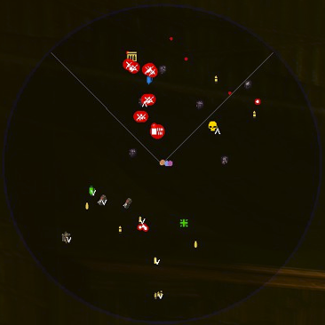
  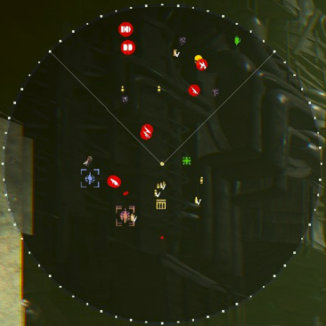
  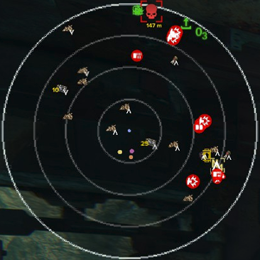
</p>

### Square Radar

<p>
  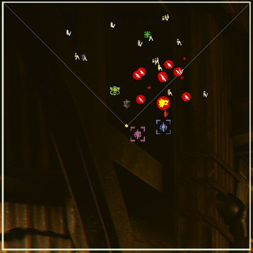
  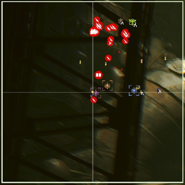
  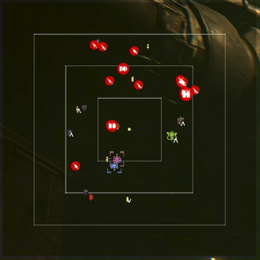
</p>

### Auspex Radar

The **Auspex** style provides a more diegetic scanner look. It supports the same gameplay marker data as the other radar styles, plus an optional animated sweep that can be disabled independently. In 2.2.0, the Auspex scanner background can also be selected as a guide option for Square and Circle radar styles.

<p>
  
  
  
  
</p>

### Centered overview mode

The keybind-based **centered overview mode** temporarily expands the radar into a larger centered tactical view. It uses its own zoom range from **25 m** to **500 m**, can show scale legends beside the radar, and has a separate marker cap so dense overview scans can be tuned independently from the normal radar.

### Nearby highlight example

Nearby highlights add small screen-space brackets for supported non-enemy markers when they are close enough to matter. You can tune their thickness, set per-marker highlight colors with ARGB color pickers, and show item distance text on the screen highlight, the radar marker, or both. Objective brackets frame the middle of the device, and hazard barrel brackets sit on the barrel body even when the barrel hangs from a ceiling mount. See [Screen highlight anchoring](#screen-highlight-anchoring).

<p>
  
</p>

### Resource charges and deployed medical radius

Medicae Stations and deployed Ammo Crates can show their remaining team-resource charges as a small number near the top-right of the marker. If nearby radar-marker distance text is also enabled for that marker group, distance text stays below the icon.

<p>
  
  
  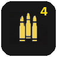
  
</p>

Deployed Medical Crates add a circular healing-radius indicator behind the marker. The ring scales with the current radar range so the radar area reflects the in-game healing radius, and it is hidden when the full ring would extend outside the radar bounds.

### Vertical item and enemy arrows

Vertical arrows add a small **up** or **down** overlay to supported markers when the target is on a different level but still close enough horizontally to matter. Item markers can use this behavior globally, and enemy markers can now use it per enemy category: **Boss**, **Horde**, **Common**, **Shooter**, **Elite**, **Special**, and **Misc**.

The arrow range and vertical hiding threshold remain global, so enemy arrows reuse the same distance behavior as supported item arrows without adding separate per-category hiding rules.

<p>
  
  
  
</p>

## Map geometry

Since 2.6.0, Radar can draw the mission's walkable floor plan as the bottom layer of the radar, above the radar background but beneath the outline, guides, Auspex effects, and every marker. The geometry uses the same position, rotation, range, and zoom as the markers, works with the **Square**, **Circle**, and **Auspex** styles, and also renders in the centered overview mode.

The screenshots below show the centered overview with map geometry in a multi-storey interior and over an open Expedition scavenge zone, where the floor bands separate the canyon levels:

<p>
  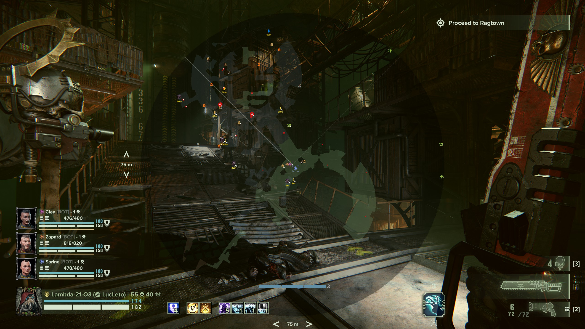
  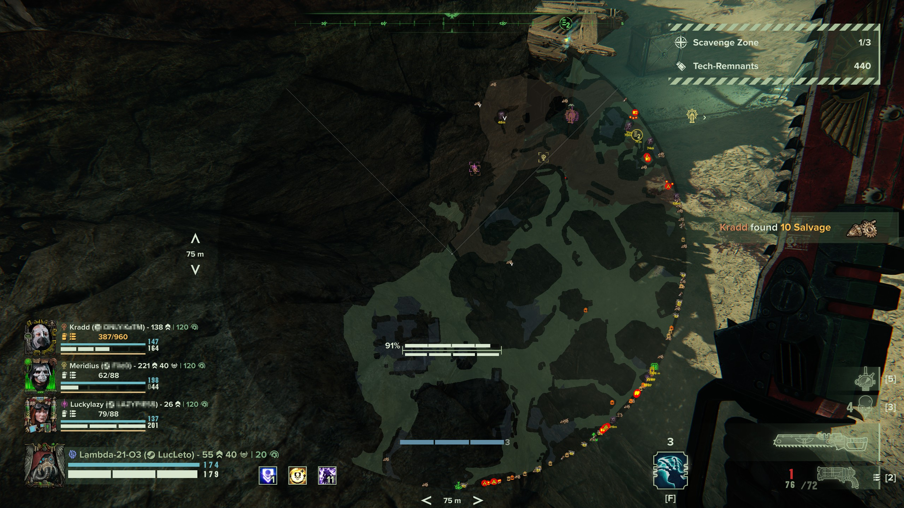
</p>

The **Map geometry source** dropdown in the **Map Geometry** settings group selects how the floor plan is produced. Exactly one source is drawn at a time:

| Source | Behavior |
| --- | --- |
| **Off** | Default. No geometry layer; the radar renders exactly as in earlier versions. |
| **Live scan (built-in)** | Reads the mission's navigation mesh directly. Works in every game mode, including Expeditions, and needs no other mods. |
| **Strikemap floor plan** | Draws the pre-baked floor plan from the [Strikemap](https://www.nexusmods.com/warhammer40kdarktide/mods/1022) mod through its public compatibility API. Requires Strikemap to be installed and active. |
| **Auto** | Prefers the Strikemap floor plan and falls back to the live scan whenever no Strikemap geometry is available. |

The built-in **Live scan** source, its navmesh reader, and the geometry renderer were contributed by **dreams**.

### Floor bands

The floor plan is shaded in three height bands relative to your current position, so overlapping levels stay readable:

- **Current floor** (within about 2.5 m of your height) renders brightest, in sage green by default.
- **Floors above** render as a faint cool-blue veil drawn on top, so upper walkways read as "over you" without hiding your own floor.
- **Floors below** render dimmer in a warm umber beneath your floor.

Each band has its own ARGB color picker under **Map Geometry**, shown while a geometry source is selected; its **A** channel is that band's opacity, and **0** hides the band entirely. On the normal radar, **Floors Above Range** and **Floors Below Range** (in meters) limit how far up and down geometry is shown. The defaults, **3 m** above and **7 m** below, are tuned for stacked interiors; on open terrain with large height differences, such as Expedition canyons, raise them (for example **15 m**) to keep ramps and upper areas visible. Centered overview mode ignores both sliders and always uses **30 m** above and below.

On the compact radar, the floor plan stays beneath the regular marker presentation, so pickups, tagged targets, teammates, and distance text render unchanged on top of the geometry:

<p>
  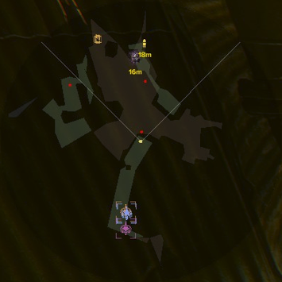
  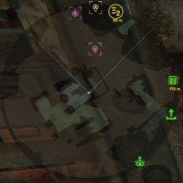
</p>

### Strikemap integration notes

- The combined mode requires an active [Strikemap](https://www.nexusmods.com/warhammer40kdarktide/mods/1022) installation with its compatibility API enabled (**Allow External Mods to Use Strikemap Geometry**, on by default in Strikemap's settings). Radar itself never requires Strikemap.
- Radar remains responsible for all displayed markers, filtering, and interaction; only the floor plan comes from Strikemap. No Strikemap map data or assets are bundled with Radar, and no additional entity scans are added.
- The integration fails safely: if Strikemap is missing, disabled, still loading, has no map for the current mission, or exposes an incompatible API version, Radar falls back to its standard background, or to the live scan when the source is **Auto**, and logs the reason once.
- **Show geometry in overview mode** controls whether the Strikemap floor plan is also drawn in the centered overview.
- Strikemap's own mission recording and report browser keep working alongside the integration, and its optional geometry-only settings let it hand the live minimap over to Radar entirely.
- How the integration is loaded and how it fails safe is covered in [Compatibility Integrations](#strikemap).

## Display and Behavior

**Square** and **Circle** radar styles support the same outline and guide options, and the frame rendering is tuned so crosshairs fit the active frame, view guides reach the border cleanly, circle range rings stay thin and solid, circle outlines remain visually continuous, and square dotted outlines render as proper dots.

The **Auspex** style still provides its own frame treatment, and the same scanner background can also be used as an **Auspex background** guide on Square or Circle radar styles. The animated sweep toggle applies to both.

The centered overview mode reuses the active radar presentation but moves it to the center of the screen and expands it up to the available UI space. Overview zoom is separate from the normal radar range, so you can briefly scan a wider area without permanently changing the compact HUD radar.

### Square radar variants
| Guide | Solid | Dotted | Off |
|---|---|---|---|
| Crosshair | 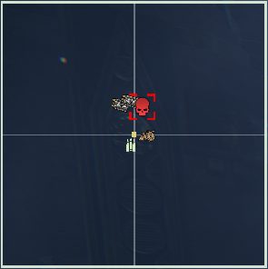 | 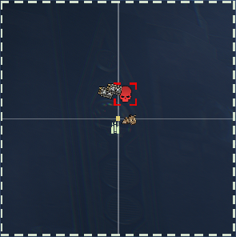 | 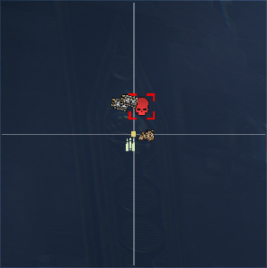 |
| View Guides | 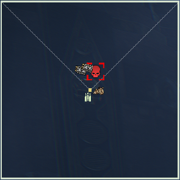 | 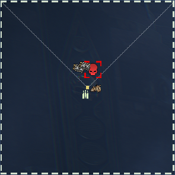 | 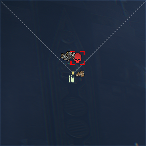 |
| Rings | 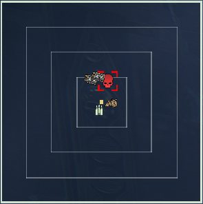 | 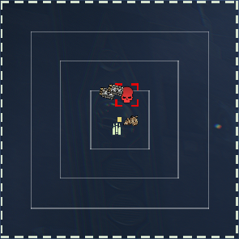 | 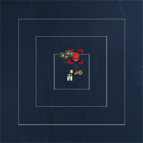 |
| Off | 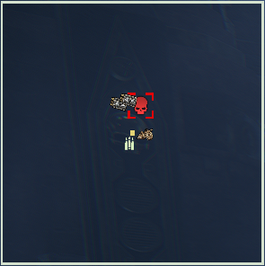 | 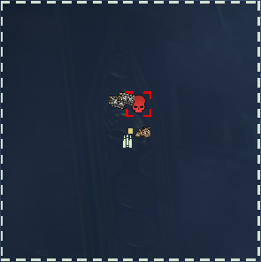 | 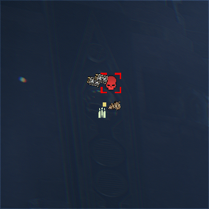 |

### Circle radar variants
| Guide | Solid | Dotted | Off |
|---|---|---|---|
| Crosshair | 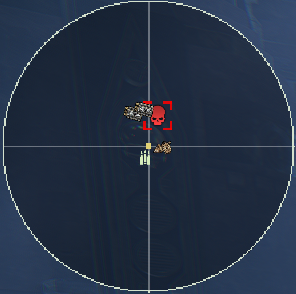 | 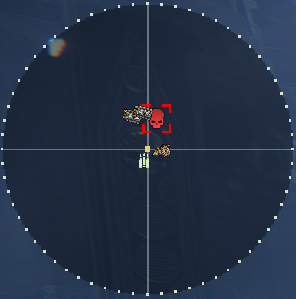 | 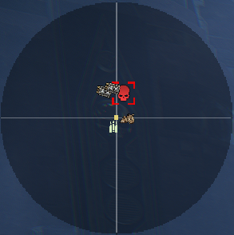 |
| View Guides | 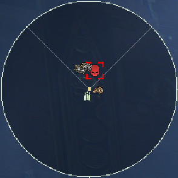 | 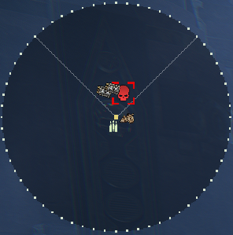 | 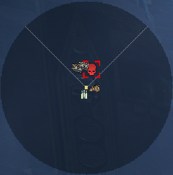 |
| Rings | 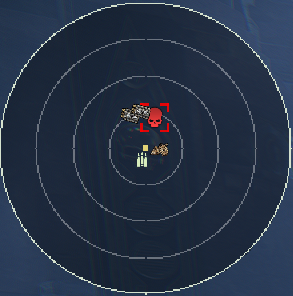 | 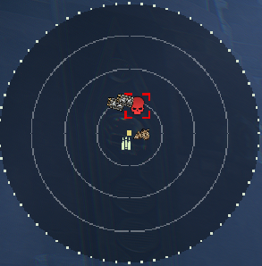 | 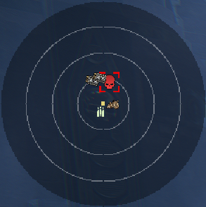 |
| Off | 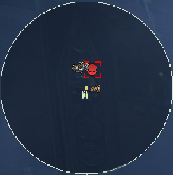 | 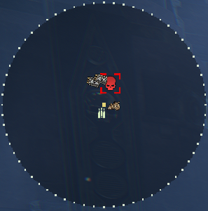 | 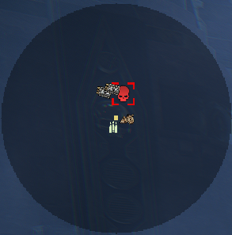 |

## Expedition POI display modes

Expedition POI settings use dropdown display modes instead of simple on/off toggles. Each supported POI category can be configured independently.

- **Icon only** shows the POI icon without distance text.
- **Icon + Distance m** shows the POI icon together with its current distance in meters.
- **Off** hides that POI category.
- Existing saved boolean settings are migrated automatically, with old `true` values becoming **Icon only** and old `false` values becoming **Off**.

| POI category | Default display mode |
| --- | --- |
| Sites of Interest | **Icon + Distance m** |
| Deadsider Sanctuaries | **Icon only** |
| Data Reliquary Harvesters | **Icon only** |
| Main Objective | **Icon only** |
| Valkyrie Extraction Zone | **Icon only** |
| Valkyrie Arrival Zone | **Icon only** |

### Player-marked POI rings

When players mark an Expedition navigation POI through the Auspex map, Radar surrounds its icon with the same segmented marker material used by the game:

- One marking player fills the complete ring with that player's bright slot color.
- Two to four marking players divide the ring into equal colored sections, ordered consistently by player slot.
- If the local player is one of several markers, the center icon uses the local player's slot color. Otherwise, Radar uses the lowest marked player slot for the center icon.
- The ring follows POI icon scaling and updates immediately when its display mode, marked players, or size changes.

## Artwork, Icon, Off display modes

Supported artwork-based markers now use dropdowns instead of simple booleans. Each supported marker can be shown as **Artwork**, **Icon**, or **Off**.

- **Artwork** uses the original item artwork or pickup art.
- **Icon** uses a simplified HUD icon material with a configurable ARGB tint.
- **Off** hides that specific marker entirely.
- Existing saved boolean settings are migrated automatically: old `true` values become **Artwork** and old `false` values become **Off**.

### Common pickups and materials

| Marker | Artwork | Icon | Off |
| --- | --- | --- | --- |
| Crates |  |  | Hidden |
| Diamantine |  |  | Hidden |
| Plasteel |  |  | Hidden |

### Expeditions-specific items with display modes

| Marker | Artwork | Icon | Off |
| --- | --- | --- | --- |
| Salvage |  |  | Hidden |
| Tech-Remnants |  |  | Hidden |
| Dropped Tech-Remnants |  |  | Hidden |
| Servo-Triggered Mine |  |  | Hidden |
| Purgation Snare |  |  | Hidden |
| Voltaic Snare |  |  | Hidden |
| Void Shell |  |  | Hidden |
| Bombing Run Signal Marker |  |  | Hidden |
| Artillery Locator Beacon |  | 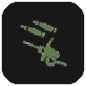 | Hidden |
| Modified Grenade |  |  | Hidden |
| Fire-Support Signal Marker |  |  | Hidden |

### Live-event items with display modes

| Marker | Artwork | Icon | Off |
| --- | --- | --- | --- |
| Tainted Skulls | 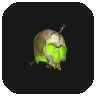 |  | Hidden |
| Holy Relics, Small | 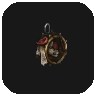 |  | Hidden |
| Holy Relics, Medium | 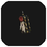 |  | Hidden |
| Holy Relics, Large | 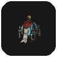 |  | Hidden |
| Heretical Artifacts, Small | 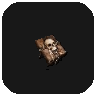 |  | Hidden |
| Heretical Artifacts, Medium | 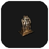 |  | Hidden |
| Heretical Artifacts, Large | 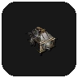 |  | Hidden |
| Stolen Rations, Small | 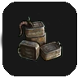 |  | Hidden |
| Stolen Rations, Medium | 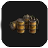 |  | Hidden |

### Tech-Remnant cluster example

The example below shows **Tech-Remnant marker mode** set to **Merge nearby piles**. In this mode, nearby piles are combined into a single clustered radar marker, which helps reduce clutter in dense expedition loot areas.
Also for reference **Show tech-remnant value text** is set to **true**.

<p>
  
</p>

## Radar Controls

| Option | What it controls |
| --- | --- |
| Enable radar | Master on or off switch for the HUD element. |
| Enable in Regular Missions | Enables or disables the radar for standard mission runs. |
| Enable in Havoc | Enables or disables the radar in Havoc. |
| Enable in Mortis Trials | Enables or disables the radar in Mortis Trials. |
| Enable in Expeditions | Enables or disables the radar in Expeditions. |
| Toggle radar on or off | Assign a key to switch the radar HUD visibility during gameplay without opening the options menu. |
| Toggle overview mode | Assign a key to switch the centered overview mode on or off during gameplay. |
| Radar zoom modifier | Hold this key to make the radar zoom keybinds control the normal radar instead of only overview mode. While held, shared zoom inputs such as mouse wheel are captured for radar zoom only. |
| Radar zoom in | Zooms the radar in. Works in overview mode, or on the normal radar while the radar zoom modifier is held. |
| Radar zoom out | Zooms the radar out. Works in overview mode, or on the normal radar while the radar zoom modifier is held. |
| Reset radar zoom | In overview mode, fits the overview scale to the currently rendered normal-range markers. On the normal radar, hold the radar zoom modifier and press this key to reset to **10 m / 2.0x**. |
| Show scale legends | Shows overview scale legends next to the radar while centered overview mode is active. |
| Radar size | Adjustable from **100** to **1200**. |
| Radar range / filter distance | Adjustable from **10 m** to **200 m** for the normal radar. |
| Show vertical arrows within range (m) | Adjustable from **25 m** to **100 m**. Supported item markers and enemy markers with vertical arrows enabled show a small **up** or **down** arrow when they are on another level and still within this horizontal range. |
| Hide vertical markers above/below (m) | Adjustable from **8 m** to **50 m**. Supported item markers and enemy markers with vertical arrows enabled are hidden when their vertical separation is larger than this value. |
| Max radar markers | Adjustable from **10** to **200** for the normal radar. |
| Max overview markers | Adjustable from **100** to **300** for centered overview mode. |
| Scale icons with radar size | Keeps marker size fixed or scales it with the radar. The final combined icon size is capped at **4.0x**. |
| Radar style | **Square**, **Circle**, or **Auspex**. |
| Radar outline | **Solid**, **Dotted**, or **Off**. Only used by the **Square** and **Circle** radar styles. |
| Radar guides | **Crosshair**, **View guides**, **Range rings**, **Auspex**, or **Off**. Only used by the **Square** and **Circle** radar styles. |
| Radar Colors | ARGB color pickers for Radar UI colors such as background, outline, guides, Auspex layers, marker text, vertical arrows, and overview legend indicators. |
| Animated radar sweep | Enables or disables the animated sweep used by the **Auspex** radar style and **Auspex** guides. |
| Map geometry source | **Off**, **Live scan (built-in)**, **Strikemap floor plan**, or **Auto**. Draws the mission's walkable floor plan beneath all radar markers; **Auto** prefers Strikemap and falls back to the live scan. |
| Map geometry colors | ARGB color pickers for the current-floor, floor-above, and floor-below bands. Each band's **A** channel is its opacity; **0** hides that band. |
| Floors Above Range | Adjustable from **1 m** to **30 m** for the normal radar. Geometry more than this far above you is hidden; centered overview always uses **30 m**. |
| Floors Below Range | Adjustable from **1 m** to **30 m** for the normal radar. Geometry more than this far below you is hidden; centered overview always uses **30 m**. |
| Show geometry in overview mode | Also draws the Strikemap floor plan while centered overview mode is active. |
| Nearby highlight range (m) | Adjustable from **5 m** to **20 m**. Controls how close supported items must be before their screen-space bracket highlights appear. |
| Highlight thickness | Adjusts the line thickness used by nearby screen-space highlight brackets. |
| Show distance above nearby highlights | Shows item distance text above supported nearby screen-space highlights. |
| Show distance on radar markers | Shows distance text on supported nearby radar markers. |
| Medicae Station Charges | Shows remaining healing charges on Medicae Station radar markers when their marker is visible. |
| Ammo Crate Charges | Shows remaining resupply charges on deployed Ammo Crate radar markers when their marker is visible. |
| Boss marker style | **Icon only** or **Marked icon**. |
| Boss marker range | **Normal** or **Infinite**. Lets boss-type markers follow the normal radar range or stay visible at any distance. |
| Show boss distance text | Shows yellow distance text in meters for bosses except the daemonhost. |
| Teammates | Shows or hides teammate markers on the radar. |
| Teammate state icons | Replaces teammate class or dot markers with contextual state icons. |
| Player marker range | **Normal** or **Infinite**. Lets teammate markers follow the normal radar range or stay visible at any distance. |
| Player center dot | Shows or hides your own center point on the radar. |
| Player marker style | **Icon only**, **Marked icon**, **Dot only**, or **Marked dot**. |
| Player companions - Icon size (%) | Resizes Cyber Mastiff and Servo Skull markers independently from player markers. Default: **100%**. |
| Show Cyber Mastiff | Shows or hides friendly Arbitrator Cyber Mastiff markers. |
| Show Servo Skulls | Shows or hides friendly Skitarii Servo Skull markers. |
| Player Tags | Shows or hides player smart tags and pings on the radar. |
| Show player tag distance text | Shows the current distance in meters next to player tag markers. |
| Ability-marked enemies | Also includes supported ability-marked and smart-tag outlined enemies such as keystone, passive, and callout-driven outline states. |
| Tagged enemies only | Only shows enemy markers while the enemy has an active in-game tag. Tagged enemies also ignore the normal radar range limit while tagged. |
| Tagged items only | Only shows supported item markers while the item has an active in-game tag. Tagged items also ignore the normal radar range limit while tagged. |
| Player tag display style | **Icon only** or **Marked icon**. |
| Radar anchor | **Top left**, **Top right**, **Bottom left**, or **Bottom right**. Sets the corner the radar offsets from. |
| Allow unrestricted radar positioning | Removes the normal UI-space clamping fallback, which is useful for ultrawide or highly customized layouts. |
| Horizontal offset | Sets the radar's horizontal offset from the selected anchor. |
| Vertical offset | Sets the radar's vertical offset from the selected anchor. |
| Steps per input | Sets how far each radar movement key press nudges the radar. |
| Move radar left | Assign a key to move the radar left by the configured step size. |
| Move radar right | Assign a key to move the radar right by the configured step size. |
| Move radar up | Assign a key to move the radar up by the configured step size. |
| Move radar down | Assign a key to move the radar down by the configured step size. |


### Marker display mode controls

| Option group | Markers | Modes |
| --- | --- | --- |
| Common Pickups | Crates | **Artwork**, **Icon**, **Off** |
| Collectable Materials | Diamantine, Plasteel | **Artwork**, **Icon**, **Off** |
| Expeditions-Specific Items | Salvage, Tech-Remnants, Dropped Tech-Remnants, Servo-Triggered Mine, Purgation Snare, Voltaic Snare, Void Shell, Bombing Run Signal Marker, Artillery Locator Beacon, Modified Grenade, Fire-Support Signal Marker | **Artwork**, **Icon**, **Off** |
| Event-Related Items | Tainted Skulls, Holy Relics, Heretical Artifacts, Stolen Rations | **Artwork**, **Icon**, **Off** |
| Expedition POIs | Sites of Interest, Deadsider Sanctuaries, Data Reliquary Harvesters, Main Objective, Valkyrie Extraction Zone, Valkyrie Arrival Zone | **Icon only**, **Icon + Distance m**, **Off** |
| Mission Objective Interactables | Scanner targets, Hacking terminals, Servo skull objectives, Daemonic growth, Targets to destroy, Other objective interactions | **Icon only**, **Icon + Distance m**, **Off** |
| Environment | Explosive Barrels, Fire Barrels | **Icon only**, **Icon + Distance m**, **Off** |
| Respawn | Active respawn, Run-back threshold, Practice respawn points, Practice thresholds | **Icon only**, **Icon + Distance m**, **Off** |
| Enemy bosses | Daemonhost, Monstrosities, Captains, Karnak Twins | **Icon only**, **Marked icon** |
| Enemy groups | Common enemies and Shooters | **Icon only**, **Marked icon**, **Off** |
| Individual enemy toggles | Dreg and Scab Bruisers, Vanguards, Shooters, Elite, Special, and Misc enemies listed below | **Icon only**, **Marked icon**, **Off** |

### Per-category icon size controls

Each major option group now includes an **Icon size (%)** slider. These sliders resize the whole marker family from **50%** to **300%**. When combined with **Scale icons with radar size**, the final rendered icon size is still capped at **4.0x**.

| Option group | Affects |
| --- | --- |
| Common Pickups | Crates, ammo, grenades, portable crates, and stimms |
| Collectable Materials | Diamantine and Plasteel |
| Primary Objective Items | Mission luggables and primary objective pickups |
| Secondary Objective Items | Grimoires and Scriptures |
| Mission Objective Interactables | Scanner targets, hacking terminals, servo skull objectives, daemonic growth, targets to destroy, and other objective interaction points |
| Expeditions POI | Sites of Interest, sanctuaries, harvesters, main objective, extraction, and arrival markers |
| Expeditions-Specific Items | Salvage, Tech-Remnants, expedition pocketables, and related expedition pickups |
| Martyr's Skull Items | Martyr's Skull markers, riddle interactables, and related power cell markers |
| Environment | Medicae Station, Power Socket, Heretic Idol, Explosive Barrels, and Fire Barrels |
| Deployed Items | Ammo Crate and Medical Crate deployables |
| Enemies | High-priority boss markers |
| Enemy Boss | Daemonhost, Monstrosities, Captains, Karnak Twins |
| Enemy Horde | Horde enemies |
| Enemy Common | Common enemies |
| Enemy Shooter | Shooter enemies |
| Enemy Elite | Elite enemies |
| Enemy Special | Special enemies |
| Enemy Misc | Ritualists |
| Players | Teammate markers |
| Player Companions | Cyber Mastiffs and Servo Skulls |
| Event-Related Items | Event pickups and event objectives, including Dark Rites totems and servo skulls |
| Respawn | Active respawn, run-back threshold, and the practice respawn points and thresholds |
| Debugging | Unknown pickup markers and debug visuals |

### Enemy radar controls

| Option | What it controls |
| --- | --- |
| Monstrosities | Shows daemonhost and generic monstrosity markers. |
| Ability-marked enemies | Also includes enemies while they have a supported ability or smart-tag outline, subject to the normal enemy display rules. |
| Captains | Shows captain markers. |
| Karnak Twins | Shows the dedicated Karnak Twins marker. |
| Horde enemies | Single toggle for horde markers. Horde enemies stay on or off rather than using per-unit display modes. |
| Common enemies | Independent display-style dropdowns for Dreg Bruisers, Scab Bruisers, Dreg Vanguards, and Scab Vanguards. |
| Shooters | Independent display-style dropdowns for Dreg Stalkers, Scab Stalkers, and Scab Shooters. |
| Elite enemies | Per-unit display-style dropdowns for Dreg Gunners, Ragers, Shotgunners, Scab Gunners, Maulers, Plasma Gunners, Ragers, Shotgunners, and Ogryn elites. |
| Special enemies | Per-unit display-style dropdowns for Bombers, Flamers, Mutants, Poxbursters, Hounds, Snipers, and Trappers. |
| Ritualist | Dedicated toggle under the misc enemy category. |

### Enemy vertical arrow controls

Enemy vertical arrows are controlled per enemy category. These options only control whether the **up** or **down** arrow overlay can be shown for that category. They do not change the core marker visibility, display style, range mode, or tagged-only behavior.

| Option | What it controls |
| --- | --- |
| Show boss vertical arrows | Enables vertical arrows for daemonhost, monstrosity, captain, and Karnak Twin markers. |
| Show horde vertical arrows | Enables vertical arrows for horde enemy markers. |
| Show common enemy vertical arrows | Enables vertical arrows for common enemy markers. |
| Show shooter vertical arrows | Enables vertical arrows for shooter enemy markers. |
| Show elite vertical arrows | Enables vertical arrows for elite enemy markers. |
| Show special vertical arrows | Enables vertical arrows for special enemy markers. |
| Show misc enemy vertical arrows | Enables vertical arrows for misc enemy markers, currently Ritualists. |

All enemy vertical arrow options use the shared **Show vertical arrows within range (m)** and **Hide vertical markers above/below (m)** settings.

### Nearby highlight controls

| Option | What it controls |
| --- | --- |
| Highlight thickness | Adjusts the line thickness used by nearby screen-space highlight brackets. |
| Marker highlight colors | ARGB color pickers used directly by nearby highlights for a specific supported marker. |
| Show distance above nearby highlights | Shows item distance text above supported nearby screen-space highlights. |
| Show distance on radar markers | Shows distance text on supported nearby radar markers. |

| Option group | What it controls |
| --- | --- |
| Common Pickups | Highlights nearby ammo, grenades, crates, portable crates, and stimms. |
| Collectable Materials | Highlights nearby diamantine and plasteel. |
| Primary Objective Items | Highlights nearby mission luggables and main objective pickups. |
| Secondary Objective Items | Highlights nearby grimoires and scriptures. |
| Mission Objective Interactables | Highlights nearby scanner targets, hacking terminals, and other active objective interaction points. Servo skull objectives are excluded because the game already draws its own on-screen marker for them. |
| Expeditions-Specific Items | Highlights nearby salvage, tech-remnants, expedition pocketables, and related expedition pickups. |
| Martyr's Skull Items | Highlights nearby Martyr's Skull items, riddle interactables, and orange power cell markers. |
| Environment | Highlights nearby medicae stations, power sockets, heretic idols, and hazard barrels. |
| Deployed Items | Adds nearby radar-marker distance text for deployed ammo and medical crates. |
| Event-Related Items | Highlights nearby event pickups and event objectives, including Dark Rites totems and servo skulls. |

### Tech-Remnant controls

| Option | What it controls |
| --- | --- |
| Tech-Remnant marker mode | **Default**, **Scale by value**, or **Merge nearby piles**. |
| Show cluster value | Shows a value badge on clustered tech-remnant markers. |
| Cluster horizontal radius | Horizontal merge range for clustered tech-remnant markers. |
| Cluster vertical radius | Vertical merge range for clustered tech-remnant markers. |

### Expedition POI Controls

| Option | Modes / default | What it controls |
| --- | --- | --- |
| Expeditions POI | Option group | Contains independent display mode dropdowns for expedition location markers. |
| Ignore range limit for POI | Checkbox, default on | Lets expedition POI markers bypass the normal radar range filter. |
| Sites of Interest | **Icon only**, **Icon + Distance m**, **Off**. Default: **Icon + Distance m**. | Controls registered expedition opportunity locations, including numbered scanner-map opportunity markers. |
| Deadsider Sanctuaries | **Icon only**, **Icon + Distance m**, **Off**. Default: **Icon only**. | Controls expedition transition or sanctuary locations with the dedicated transition icon. |
| Data Reliquary Harvesters | **Icon only**, **Icon + Distance m**, **Off**. Default: **Icon only**. | Controls expedition loot converters with the dedicated harvester icon while inside the sanctuary where they are usable, and clears stale harvester markers across sanctuary transitions. |
| Main Objective | **Icon only**, **Icon + Distance m**, **Off**. Default: **Icon only**. | Controls expedition main objective locations with the dedicated objective icon. |
| Valkyrie Extraction Zone | **Icon only**, **Icon + Distance m**, **Off**. Default: **Icon only**. | Controls extraction points with the dedicated extraction icon. |
| Valkyrie Arrival Zone | **Icon only**, **Icon + Distance m**, **Off**. Default: **Icon only**. | Controls arrival points with the dedicated arrival icon. |

### Mission Objective Interactable Controls

These markers show the world interactions of the **currently active** objective step:
- **Appears early.** A step appears as soon as the mission arms it, not only once you are close enough for the interaction prompt, so objectives are visible from across a room.
- **Clears when done.** A marker clears when its step is used, scanned, solved, broken or completed, and when the objective itself ends.
- **Unused alternatives stay hidden.** Where a mission places several copies of a device or files several alternatives under one objective, only the one the mission actually uses is shown.
- **Range.** A step the game is itself pointing at stays on the radar beyond its range, but only while the game draws that marker.
- **Height.** Objective markers are never hidden for being above or below you, whatever **Hide vertical markers above/below** is set to.

How these rules are implemented is explained in [Mission objective tracking](#mission-objective-tracking).

Objective devices that carry a puzzle, such as Auspex decoding or bomb defusal, show in color whether they need somebody, following the device's own hologram:

| Puzzle | Marker |
| --- | --- |
| Not started yet | The shared objective tint, like any other objective marker |
| Running, nobody at it | **Red**: the device is asking for a player |
| A player at the device | **Yellow**: the device is being worked on |
| Solved | The shared objective tint again; the device stays part of the objective |

A device keeps its marker for as long as its objective runs, so nothing blinks out and comes back red when an objective arms the same device for another round. The two live colors have their own color pickers under **Hacking terminals**, because every puzzle device is configured there whichever category it belongs to. The icon, display mode and icon size stay those of the device's own category. Only the color follows the puzzle, and the on-screen highlight bracket follows it too.

| Option | Modes / default | What it controls |
| --- | --- | --- |
| Mission Objective Interactables | Option group | Groups the icon-size, nearby-highlight, distance-text, and per-category display mode controls. |
| Scanner targets | **Icon only**, **Icon + Distance m**, **Off**. Default: **Icon only**. | Controls scanning targets tied to the current mission objective. |
| Hacking terminals | **Icon only**, **Icon + Distance m**, **Off**. Default: **Icon only**. | Controls hacking terminals and decoding spots tied to the current mission objective. |
| Servo skull objectives | **Icon only**, **Icon + Distance m**, **Off**. Default: **Icon only**. | Controls the mission servo skull while you follow it. Its position updates at the configured **Marker update rate** rather than the slower pickup rate, since it moves. It gets no nearby highlight bracket and needs a larger height difference than other markers before a vertical arrow appears, because it hovers and bobs in flight. |
| Daemonic growth | **Icon only**, **Icon + Distance m**, **Off**. Default: **Icon only**. | Controls the daemonic growth targets of a purge event. Has its own icon and color rather than the shared objective tint. |
| Targets to destroy | **Icon only**, **Icon + Distance m**, **Off**. Default: **Icon only**. | Controls the targets any other objective marks for destruction, such as ice on machinery, tanks and cogitators. Has its own icon, icon color and highlight color. |
| Other objective interactions | **Icon only**, **Icon + Distance m**, **Off**. Default: **Icon only**. | Controls the remaining objective-bound interaction points, such as switches, buttons, and mission-scripted interactions that do not fall into the categories above. |

### Martyr's Skull Controls

| Option | What it controls |
| --- | --- |
| Martyr's Skull Items | Groups the icon-size, nearby-highlight, distance-text, skull, riddle-interactable, and power-cell controls. |
| Martyr's Skull | Shows the collectible Martyr's Skull. |
| Riddle interactables | Shows active, supported Martyr's Skull riddle keys, levers, switches, buttons, and related puzzle controls. Completed or used steps clear automatically instead of returning on later scans. On Smelter Complex the two growth tentacles blocking the riddle's door carry this marker until they are destroyed; the one above the skull is not needed and is not drawn. |
| Power Cell | Shows orange power cells used by Martyr's Skull riddles. |

### Environment Controls

| Option | What it controls |
| --- | --- |
| Environment | Group of toggles for interactable world objects and hazard barrels that are useful to spot on the radar. |
| Explosive Barrels | Shows static explosive hazard barrels. Supports **Icon**, **Icon + Distance**, and **Off**; defaults to **Icon**. |
| Fire Barrels | Shows static fire/promethium hazard barrels. Supports **Icon**, **Icon + Distance**, and **Off**; defaults to **Icon**. |
| Medicae Station | Shows medicae station and equivalent health station interactions. |
| Medicae Station Charges | Shows the remaining healing charges on visible Medicae Station markers. Unpowered stations with a missing battery use a light grey marker, while fully depleted stations follow the game's marker visibility. |
| Power Socket | Shows luggable power socket targets. Sockets for other mission cargo, such as vacuum capsules, ammunition canisters, cryonic rods, Moebian samples, and the Prismata case, follow Other objective interactions instead. |
| Heretic Idol | Shows active heretic idols while they are still present. |

### Deployed Items Controls

| Option | What it controls |
| --- | --- |
| Deployed Items | Group of controls for player-deployed team support tools. |
| Show distance on radar markers | Shows distance text below nearby deployed Ammo Crate and Medical Crate radar markers. |
| Ammo Crate | Shows deployed Ammo Crate markers. |
| Ammo Crate Charges | Shows remaining resupply charges on visible deployed Ammo Crate markers. |
| Medical Crate | Shows deployed Medical Crate markers with a radar-scaled healing-radius ring. |

### Event Controls

| Option | What it controls |
| --- | --- |
| Event-Related Items | Group of controls for live-event pickups and event objectives. |
| Tainted Skulls | Shows tainted skull pickups from skull live-event circumstances as artwork, simplified icon, or hidden. |
| Dark Rites Totems | Shows destroyable Dark Rites ritual totems while they are still active. |
| Dark Rites Servo Skulls | Shows the spawned Dark Rites servo skull objective interactable. |
| Tainted Communications Device | Shows corrupted auspex scanner event pickups. |
| Holy Relics | Shows Holy Relics event pickups as artwork, simplified icon, or hidden. Artwork mode distinguishes small, medium, and large relic pickups. |
| Heretical Artifacts | Shows Heretical Artifacts event pickups as artwork, simplified icon, or hidden. Artwork mode distinguishes small, medium, and large pickups. |
| Stolen Rations | Shows Stolen Rations event pickups as artwork, simplified icon, or hidden. Artwork mode distinguishes small and medium pickups. |

### Respawn Controls

The **Respawn (requires Respawn Rewind)** tab controls markers mirrored from the [Respawn Rewind](#respawn-rewind) mod. Without that mod installed and enabled, these settings have no effect. Each marker also needs the matching Respawn Rewind setting switched on, and the tooltips name it. Radar never changes Respawn Rewind's settings itself.

| Option | Modes / default | What it controls |
| --- | --- | --- |
| Icon size (%) | Slider, default **100%** | Resizes all respawn markers together. |
| Active respawn | **Icon only**, **Icon + Distance m**, **Off**. Default: **Icon + Distance m**. | The respawn beacon a dead teammate will return to. Shown only while Respawn Rewind shows it, that is while a teammate is dead or awaiting respawn. |
| Run-back threshold | **Icon only**, **Icon + Distance m**, **Off**. Default: **Icon + Distance m**. | The point the team has to stay behind for the earlier beacon to be kept. |
| Show run-back offset | Checkbox under **Run-back threshold**, default on | Shows Respawn Rewind's team offset from the threshold instead of the distance to the marker. A negative value is the room the team still has. Needs Respawn Rewind's distance text. Without it, or for its `Hold back` fallback, the normal distance is shown. |
| Practice respawn points | **Icon only**, **Icon + Distance m**, **Off**. Default: **Off**. | Every respawn point of the mission, from Respawn Rewind's map practice mode. |
| Practice thresholds | **Icon only**, **Icon + Distance m**, **Off**. Default: **Off**. | The threshold of every respawn point, from the same practice mode. |
| Practice markers in overview only | Checkbox, default on | Keeps the practice markers out of the normal radar and shows them only in the centered overview, where the whole mission fits. |

Each marker has its own icon color picker, which is hidden while the marker is **Off**. The active respawn and the run-back threshold stay on the radar beyond its range, pinned to the edge in their direction the way player tags are. All four respawn markers are never hidden for being above or below you.

### Positioning and Toggle Use

- Use **Toggle radar on or off** for quick in-mission HUD control, or the per-mode enable toggles if you want Radar active only in selected activities.
- Use **Toggle overview mode** when you need a temporary centered tactical scan without changing your normal anchored radar placement.
- Use **Radar zoom in**, **Radar zoom out**, and **Reset radar zoom** in overview mode to control the overview scale. Hold **Radar zoom modifier** to apply those same zoom controls to the normal radar instead.
- Use **Radar anchor**, **Horizontal offset**, and **Vertical offset** for stable placement, then fine-tune with the movement keybinds and **Steps per input**.
- Standard placement stays clamped to the visible UI space, while **Allow unrestricted radar positioning** is available for ultrawide or advanced layouts.

### Marker Rules

- **Enemies**, **teammates**, **player companions**, and **player smart tags** each use their own display rules and settings. Teammates also have a **Player marker range** mode and an optional **Teammate state icons** override for disabled, rescue, luggable, and dead states. The local **center dot** has its own toggle and always keeps its normal dot icon.
- Companion markers use their owning player's bright slot color. Player markers take priority over following companions at the same position, while Servo Skulls performing an active task and Cyber Mastiffs pinning an enemy are drawn above the assisted or disabled unit.
- Following Servo Skulls are hidden when they are very close to their visible owner marker. Hacking, reviving, and active Purgator/Flamer skulls remain visible near their owner.
- While a Cyber Mastiff is mauling an enemy that uses Darktide's actual companion-disable behavior, that enemy's icon and background are made transparent so the Mastiff remains readable; enabled enemy marker brackets remain visible.
- Supported enemies can also be surfaced through active ability-mark or smart-tag outline states when **Ability-marked enemies** is enabled.
- **Tagged enemies only** and **Tagged items only** restrict visibility to actively tagged targets, and those tagged targets ignore the usual radar range limit while the tag remains active.
- Supported item markers and enemy markers from enabled enemy categories can show vertical **up** and **down** arrows. They use the shared vertical arrow range and shared vertical hide threshold, while nearby highlight brackets and optional distance text remain item-focused presentation features.
- Medicae Stations and deployed Ammo Crates can show their remaining team-resource charges as a small top-right number. If nearby radar-marker distance text is enabled for the same marker, the distance remains below the icon.
- Medicae Stations use the normal green marker while powered and usable. Unpowered stations with a missing battery use a light grey marker. Depleted stations without remaining charges follow the game's normal marker visibility.
- Deployed Medical Crates include a circular healing-radius indicator that scales with the configured radar range. The ring is hidden when the full radius would extend outside the radar bounds.
- Event-related markers use elevated marker priority so event objectives stay visible when dense enemy markers are nearby.
- **Expedition POIs**, **environment markers**, and **tech-remnant clusters** follow their own category-specific rules so outdated markers clear correctly and context-sensitive markers only appear when relevant.
- Expedition POIs can be shown as **Icon only**, **Icon + Distance m**, or **Off** per category. Existing boolean settings migrate to **Icon only** for enabled markers and **Off** for disabled markers.
- Player-marked Expedition navigation POIs use a segmented ring with up to four player-slot colors. One marker fills the ring; multiple markers divide it into equal sections.
- Expedition section filtering also handles **Deadsider Sanctuary** transitions. Store fixtures and sanctuary-only markers are cleared when moving back into open expedition zones, while active player-dropped Tech-Remnants remain eligible for radar display.

## Target Markers

The legend below follows the option groups exposed by `Radar_data.lua`. Enemy markers are listed in the same gameplay-oriented order used by the enemy settings: bosses, horde, common, shooters, elites, specials, and misc. Each enemy category can also enable vertical **up** and **down** arrows independently. The preview tiles were generated from the included `doc/img` assets and the default ARGB values used by the HUD presentations.

### Ability outline and smart-tag examples

These examples show supported outline states that can optionally count as radar-visible enemy targets when **Ability-marked enemies** is enabled.

| Preview | Source | Notes                                                                                                                            |
| --- | --- |----------------------------------------------------------------------------------------------------------------------------------|
|  | Adamant mark target | Example of Arbitrator's "Execution Order" target outline.                                                                        |
|  | Adamant smart tag | Example of a Cyber-Mastiff attack order style outline state.                                                                     |
|  | Broker proximity target | Example of a Hive Scum's "Enhanced Desperado" outline state.                                                                     |
|  | Psyker marked target | Example of a Psyker's "Disrupt Destiny" effect.                                                                                  |
|  | Veteran smart tag | Example of a Veteran's "Focus Target!" outline state.                                                                            |
|  | Veteran special target | Example of a Veteran's "Executioner's Stance" outline state, with local-owning-context gating to avoid unrelated shared outlines. |

### High-Priority Enemies

| Preview | Marker | Notes |
| --- | --- | --- |
|  | Daemonhost | Separate presentation under the **Monstrosities** toggle. It uses the boss marker style settings, but does **not** show boss distance text. |
|  | Monstrosities | Covers the generic monstrosity presentation used for Beast of Nurgle, Plague Ogryn, Chaos Spawn, and Ogryn Houndmaster. **Boss marker range** can be set to **Normal** or **Infinite**, and optional boss distance text is supported. |
|  | Captains | Red danger marker with bracket accent in marked mode. |
|  | Karnak Twins | Dedicated presentation for the twins. |

Display style example for boss and enemy markers:

<p>
  
  
</p>

Left: **Icon only**. Right: **Marked icon**.

### Horde Enemies

| Preview | Marker | Notes |
| --- | --- | --- |
|  | Horde enemies | Shared horde presentation used for Groaners, Moebian 21st infantry, Poxwalkers, lesser mutated poxwalkers, mutated poxwalkers, and related horde-only infected. Horde enemies use a single on or off toggle plus the **Enemy Horde** size slider. |

### Common Enemies

| Preview | Marker | Notes |
| --- | --- | --- |
|  | Dreg Bruiser | Individual common enemy display-style dropdown. |
|  | Scab Bruiser | Individual common enemy display-style dropdown. |
|  | Dreg Vanguard | Shield-melee common enemy with an independent display-style dropdown and Dreg coloring. |
|  | Scab Vanguard | Shield-melee common enemy with an independent display-style dropdown and Scab coloring. |

### Shooter Enemies

| Preview | Marker | Notes |
| --- | --- | --- |
|  | Dreg Stalker | Individual shooter enemy display-style dropdown. |
|  | Scab Stalker | Individual shooter enemy display-style dropdown. |
|  | Scab Shooter | Individual shooter enemy display-style dropdown. |

### Elite Enemies

| Preview | Marker | Notes |
| --- | --- | --- |
|  | Dreg Gunner | Individual elite enemy toggle. |
|  | Dreg Rager | Individual elite enemy toggle. |
|  | Dreg Shotgunner | Individual elite enemy toggle. |
|  | Scab Gunner | Individual elite enemy toggle. |
|  | Scab Gunner, mutator variant | Uses the same toggle and scale settings as **Scab Gunner**. |
|  | Scab Mauler | Individual elite enemy toggle. |
|  | Scab Plasma Gunner | Individual elite enemy toggle. |
|  | Scab Rager | Individual elite enemy toggle. |
|  | Scab Shotgunner | Individual elite enemy toggle. |
|  | Ogryn - Bulwark | Individual elite enemy toggle. |
|  | Ogryn - Crusher | Individual elite enemy toggle. |
|  | Ogryn - Reaper | Individual elite enemy toggle. |

### Special Enemies

| Preview | Marker | Notes |
| --- | --- | --- |
|  | Scab Bomber | Individual special enemy toggle. |
|  | Dreg Tox Bomber | Individual special enemy toggle. |
|  | Scab Flamer | Individual special enemy toggle. |
|  | Scab Flamer, mutator variant | Uses the same toggle and scale settings as **Scab Flamer**. |
|  | Dreg Tox Flamer | Individual special enemy toggle. |
|  | Mutant | Individual special enemy toggle. |
|  | Pox Hound | Individual special enemy toggle. |
|  | Pox Hound, mutator variant | Uses the same toggle and scale settings as **Pox Hound**. |
|  | Armored Pox Hound | Individual special enemy toggle. |
|  | Poxburster | Individual special enemy toggle. The default display style is **Marked icon**. |
|  | Sniper | Individual special enemy toggle. |
|  | Trapper | Individual special enemy toggle. |

Poxburster style example:

<p>
  
  
</p>

Left: **Icon only**. Right: **Marked icon**.

### Misc Enemies

| Preview | Marker | Notes |
| --- | --- | --- |
|  | Ritualist | Dedicated misc enemy toggle with its own **Enemy Misc** size slider. |

### Teammates

| Preview | Marker | Notes |
| --- | --- | --- |
|  | Teammates | Uses class icons, colored by teammate slot at runtime. Can be shown as **Icon only**, **Marked icon**, **Dot only**, or **Marked dot**. Optional contextual state icons replace the selected marker while a teammate is disabled, needs rescue, carries a luggable, or is dead. **Player marker range** can be set to **Normal** or **Infinite**, and teammate visibility can be toggled independently from the unchanged local player center dot. |

Display style example for teammate markers:

<p>
  
  
  
  
</p>

Left to right:
- **Icon only**
- **Marked icon**
- **Dot only**
- **Marked dot**

Contextual state icon examples:

<p>
  
  
  
  
</p>

From left to right: **Disabled or captured**, **Requires rescue**, **Carrying a luggable**, **Dead**. Each icon retains the teammate's assigned radar color.

Supported class icon mappings in the HUD:

<p>
  
  
  
  
  
  
  
</p>

From left to right: **Veteran**, **Zealot**, **Psyker**, **Ogryn**, **Arbitrator**, **Hive Scum**, **Skitarii**.

### Player Companions

Radar detects friendly companions belonging to the local player and teammates. Their base marker uses the owning player's bright slot color, making multiple companions easy to associate with their owner.

| Preview | Companion | Notes |
| --- | --- | --- |
|  | Cyber Mastiff | Uses Darktide's official companion glyph. When it pins and mauls a disable-capable enemy, it is drawn above that enemy; the enemy icon and background become transparent while any enabled marker brackets remain visible. |
|  | Default / Hack Servo Skull | Uses the normal Servo Skull base marker. While actively solving a hacking puzzle, it adds a white auspex annotation and remains visible near its owner. |
|  | Medicae Servo Skull | Adds a green medkit annotation. It remains visible and is drawn above the player it is actively reviving. |
|  | Purgator / Flamer Servo Skull | Adds an orange flame annotation and remains visible near its owner while its flamethrower action is active. |

Companion marker size is controlled by the dedicated **Player companions - Icon size (%)** slider, with **100%** as the default. **Show Cyber Mastiff** and **Show Servo Skulls** control the two companion families independently.

### Player Tags

| Preview | Marker | Notes |
| --- | --- | --- |
|  | Enemy | Radar support for enemy callout tags. Uses the dedicated **Player tag display style** setting and can optionally show distance text. |
|  | Go There | Radar support for movement and positioning callouts placed by players. |
|  | Look There | Radar support for attention and look-here callouts placed by players. |

Display style example for player tags:

| Tag | Icon only | Marked icon |
| --- | --- | --- |
| Enemy |  |  |
| Go There |  |  |
| Look There |  |  |

Player tags intentionally stay flatter and cleaner than supported item markers. They do not use the item-style elevation arrow presentation.

### Common Pickups

| Preview | Marker | Notes |
| --- | --- | --- |
|  | Crates | Supports **Artwork**, **Icon**, and **Off**. Artwork keeps the pickup art, icon mode uses a simplified loot icon. |
| 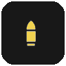 | Ammo Tin | Small ammo pickup, recolored with an ammo-specific yellow. |
|  | Ammo Stash | Large ammo pickup, recolored with an ammo-specific yellow. |
|  | Grenade | Uses a warm grenade-specific amber tint. |
|  | Ammo Crate | Pocketable ammo crate, recolored to match the ammo family. |
|  | Medical Crate | Pocketable medical crate with a medicae green tint. |
|  | Concentration Stimm | Recolored syringe template. |
|  | Med Stimm | Recolored syringe template. |
|  | Combat Stimm | Recolored syringe template. |
|  | Celerity Stimm | Recolored syringe template. |

### Collectable Materials

| Preview | Marker | Notes |
| --- | --- | --- |
|  | Diamantine | Supports **Artwork**, **Icon**, and **Off**. Icon mode uses the official Diamantine glyph. |
|  | Plasteel | Supports **Artwork**, **Icon**, and **Off**. Icon mode uses the official Plasteel glyph. |

### Primary Objective Items

| Preview | Marker | Notes |
| --- | --- | --- |
|  | Power Cell | Teal luggable objective marker. |
|  | Cryonic Rod | Pale ice-blue luggable marker. |
|  | Moebian Pox Zetaphyte-13 Sample | Sickly green luggable marker. |
|  | Vacuum Capsule | Dark steel-grey luggable marker. |
|  | Special Issue Ammo | Olive-green luggable marker. |
|  | Prismata Crystal Repository | Bright red luggable marker. |
|  | Mortis Relic | Recolored device icon. |
|  | Coordinates | Uses the paper document icon. |

### Secondary Objective Items

| Preview | Marker | Notes |
| --- | --- | --- |
|  | Grimoire | Secondary objective pocketable. |
|  | Scripture | Secondary objective pocketable. |

### Mission Objective Interactables

| Preview | Marker | Source | Notes |
| --- | --- | --- | --- |
|  | Scanner targets | Scan zone selection | The Auspex targets the active scan zone selected for this run, dropped individually as each one is scanned. |
|  | Hacking terminals | Decoder device system | Decoder and hacking terminals used for mission progression. Puzzle devices change color with their puzzle state, as shown below. The marker stays until the objective ends. |
|  | Servo skull objectives | Servo skull interaction | The mission servo skull while you follow it. |
|  | Daemonic growth | Objective target system and growth tentacles | The growth tentacles of a purge event, one marker per tentacle, on every mission that runs the event. Tentacles blocking a Martyr's Skull riddle belong to the riddle instead. Has its own display mode, color and icon. |
|  | Targets to destroy | Objective target system | What any other objective marks for destruction, such as ice on machinery, tanks and cogitators. Has its own display mode, icon color, highlight color and icon. |
|  | Other objective interactions | Objective target system | The remaining interaction points of the active objective, such as switches, buttons, valves and destructible steps, each cleared as it is completed. Also covers containers still holding a luggable objective's cargo, and the sockets for mission cargo other than power cells: vacuum capsules, ammunition canisters, cryonic rods, Moebian samples and the Prismata case. |

Puzzle state colors, shown on a hacking terminal:

<p>
  
  
  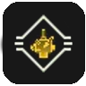
</p>

From left to right: **not started or solved**, **running with nobody at it**, **a player at the device**.

Each category has its own icon, drawn inside the diamond frame and backplate the game itself uses around objective markers. That makes the whole family easy to tell apart from enemy markers and standard points of interest at a glance. All six categories share one frame size and default to the vanilla objective marker tint, so the radar reads as the same family as the on-screen HUD marker. Each icon is sized as a proportion of the frame, so it keeps its fit at any icon scale. Each category has its own icon color picker. The frame and its backplate have one shared color each; they default to the vanilla objective tint and to the near-black the game uses behind its own objective markers.

### Expedition POIs

| Preview | Marker | Notes |
| --- | --- | --- |
|    | Sites of Interest | Unmarked expedition opportunity markers, using scanner-map glyphs with location numbering. |
|    | Sites of Interest, player-marked | One player fills the ring; additional marking players divide it into equal slot-colored sections. Up to four player colors are supported. |
|  | Deadsider Sanctuaries | Transition marker for sanctuary travel and section movement. |
|  | Data Reliquary Harvesters | Uses the expedition harvester icon and is only shown while inside the sanctuary where the converter is relevant. |
|  | Main Objective | Main expedition objective location marker. |
|  | Valkyrie Extraction Zone | Extraction location marker. |
|  | Valkyrie Arrival Zone | Arrival location marker. |

These markers are driven by expedition navigation data rather than standard pickup scanning. **Sites of Interest** can appear as unmarked opportunity markers or player-marked variants. Marked navigation POIs use a full player-colored ring for one marker and equal player-slot-colored sections for two to four markers, while the remaining expedition POIs use dedicated objective-style icons. Each POI category supports **Icon only**, **Icon + Distance m**, and **Off**. Sites of Interest default to distance text, while the other POI categories default to icon-only markers. Expedition POIs can optionally ignore the normal radar range limit, are filtered to the currently active expedition section, and clear outdated location markers when the active section or Deadsider Sanctuary state changes.

### Expeditions-Specific Items

| Preview | Marker | Notes |
| --- | --- | --- |
|  | Salvage | Supports **Artwork**, **Icon**, and **Off**. Artwork uses the salvage item art, icon mode uses a simplified salvage icon. |
|  | Tech-Remnants | Supports **Artwork**, **Icon**, and **Off**. |
|  | Dropped Tech-Remnants | Supports **Artwork**, **Icon**, and **Off**. Icon mode uses a red-tinted simplified icon to distinguish dropped loot. |
|  | Data Reliquaries | Gold luggable marker. |
|  | Servo-Triggered Mine | Supports **Artwork**, **Icon**, and **Off**. |
|  | Purgation Snare | Supports **Artwork**, **Icon**, and **Off**. |
|  | Voltaic Snare | Supports **Artwork**, **Icon**, and **Off**. |
|  | Void Shell | Supports **Artwork**, **Icon**, and **Off**. |
|  | Bombing Run Signal Marker | Supports **Artwork**, **Icon**, and **Off**. |
|  | Artillery Locator Beacon | Supports **Artwork**, **Icon**, and **Off**. |
|  | Modified Grenade | Supports **Artwork**, **Icon**, and **Off**. |
|  | Fire-Support Signal Marker | Supports **Artwork**, **Icon**, and **Off**. |
|  | Promethium Barrel | Orange explosive barrel marker. |
|  | Large Ammunition Crate | Large ammo container, recolored to match the ammo family. |
|  | Anti-Rad Stimms | Uses the expedition time syringe icon. |

### Martyr's Skull Items

| Preview | Marker | Notes |
| --- | --- | --- |
|  | Martyr's Skull | Gold skull marker. |
|  | Riddle Interactables | Gold interaction marker for active Martyr's Skull riddle keys, levers, switches, buttons, and related puzzle controls, and for the growth tentacles blocking Smelter Complex's riddle door. Completed or used steps clear automatically. |
|  | Power Cell | Orange luggable marker used for the Martyr's Skull group. |

### Environment Markers

| Preview | Marker | Notes |
| --- | --- | --- |
|  | Medicae Station | Green medical interaction marker used for medicae stations and equivalent health-station interactions. Can show remaining healing charges as a top-right number. Unpowered stations with a missing battery use a light grey marker. |
|  | Power Socket | Yellow power socket marker for luggable socket targets. While you carry a luggable, sockets stay on the radar beyond its range and on any floor. Sockets for mission cargo -- vacuum capsules, ammunition canisters, cryonic rods, Moebian samples, and the Prismata case -- feed the mission's own machinery rather than a power line, so they are drawn as Other objective interactions instead. |
|  | Heretic Idol | Sickly green idol marker shown while the idol is still active. Active idols now appear reliably on the radar. |
|  | Explosive Barrel | Tan hazard marker for static explosive barrels. Supports **Icon**, **Icon + Distance**, and **Off**. |
|  | Fire Barrel | Orange hazard marker for static fire/promethium barrels. Supports **Icon**, **Icon + Distance**, and **Off**. |

### Deployed Items

| Preview | Marker | Notes |
| --- | --- | --- |
|  | Ammo Crate | Ammo-yellow deployable ammo crate marker. Can show remaining resupply charges as a top-right number. |
|  | Medical Crate | Green deployable medical crate marker with a circular healing-radius indicator that scales with radar range. |

### Event-Related Items

| Preview | Marker | Notes |
| --- | --- | --- |
|  | Tainted Skulls | Supports **Artwork**, **Icon**, and **Off**. Artwork mode uses the skull live-event pickup art; icon mode uses the green skull marker. |
|  | Dark Rites Totems | Green heretics icon marker for destroyable Dark Rites ritual totems. |
|  | Dark Rites Servo Skulls | Green ability icon marker for spawned Dark Rites servo skull objective interactables. |
|  | Tainted Communications Device | Orange auspex scanner marker. |
|  | Holy Relics, Small | Supports **Artwork**, **Icon**, and **Off**. Artwork mode uses the small relic pickup art. |
|  | Holy Relics, Medium | Supports **Artwork**, **Icon**, and **Off**. Artwork mode uses the medium relic pickup art. |
|  | Holy Relics, Large | Supports **Artwork**, **Icon**, and **Off**. Artwork mode uses the large relic pickup art. |
|  | Heretical Artifacts, Small | Supports **Artwork**, **Icon**, and **Off**. Artwork mode uses the small artifact pickup art. |
|  | Heretical Artifacts, Medium | Supports **Artwork**, **Icon**, and **Off**. Artwork mode uses the medium artifact pickup art. |
|  | Heretical Artifacts, Large | Supports **Artwork**, **Icon**, and **Off**. Artwork mode uses the large artifact pickup art. |
|  | Stolen Rations, Small | Supports **Artwork**, **Icon**, and **Off**. Artwork mode uses the small rations pickup art. |
|  | Stolen Rations, Medium | Supports **Artwork**, **Icon**, and **Off**. Artwork mode uses the medium rations pickup art. |
|  | Stolen Rations, Icon mode | Green crate icon shared by both sizes. |

### Respawn Markers

These markers only appear while the [Respawn Rewind](#respawn-rewind) mod is installed, enabled and publishing the corresponding marker. They use Darktide's respawn point glyph (`U+E005`) and run-back point glyph (`U+E007`). The default colors start from the colors Respawn Rewind uses for its own markers, and from then on they are ordinary Radar color settings.

| Preview | Marker | Notes |
| --- | --- | --- |
|  | Active respawn | Where a dead teammate will respawn. Stays on the radar beyond its range, pinned to the edge. Survives the marker limit ahead of event markers, bosses and every other enemy or pickup; only player-dropped Tech-Remnants rank higher. |
|  | Run-back threshold | The line the team has to stay behind. Can show Respawn Rewind's team offset instead of a distance. Stays on the radar beyond its range and ranks just below the active respawn. |
| | Practice respawn points | The respawn glyph at a smaller size, in grey-blue. Off by default, and overview-only by default. |
| | Practice thresholds | The run-back glyph at a smaller size, in grey. Off by default, and overview-only by default. |

### Debug Marker

| Preview | Marker | Notes |
| --- | --- | --- |
|  | Unknown pickups | Optional fallback marker used when debug discovery is enabled. |

## Display Modes and Color Rules

The readme preview icons follow the default HUD presentations used by the mod. Most fixed marker and Radar UI colors are configurable in the mod options through native DMF ARGB color pickers:

- **A** controls the alpha channel (opacity).
- **R**, **G**, and **B** control the color channels.
- Colors customized with the four separate ARGB sliders of earlier Radar versions are carried over automatically.

The ARGB values listed below are the default values used after a fresh install or reset to defaults. Changing a color picker changes the rendered Radar colors without editing the source.

### Configurable color groups

Color pickers are placed with the setting they affect. A color that belongs to a single marker is shown under that marker and hidden while the marker is **Off**. Colors shared by several markers, such as the boss colors and the Martyr's Skull colors, stay visible:

| Area | Examples |
| --- | --- |
| Radar Colors | Radar background, outline, guides, Auspex layers, marker text, vertical arrows, and overview legend indicators |
| Marker icon colors | Pickup, objective, expedition, event, enemy, and other icon-mode marker colors |
| Marker background colors | Marked enemy and boss background or bracket colors where applicable |
| Nearby highlight colors | Per-marker highlight colors for marker groups that support nearby screen-space highlights |

Artwork mode uses original item artwork and is not tinted by these colors. Player teammate markers, player companions, and the local player center dot use runtime player/HUD colors instead of fixed configurable marker colors.

### Artwork mode

Artwork mode keeps the original item artwork for supported markers. This is the default mode for all markers that support the new display dropdowns.

Examples:
- Crates use the pickup artwork tile.
- Diamantine, Plasteel, Salvage, Tech-Remnants, and Dropped Tech-Remnants keep their resource artwork.
- Expeditions pocketables such as Void Shell, the landmines, and the strike markers keep their existing item artwork.
- Tainted Skulls, Holy Relics, Heretical Artifacts, and Stolen Rations use live-event artwork. Holy Relics and Heretical Artifacts resolve small, medium, and large pickup art from the actual pickup name, and Stolen Rations resolves small and medium.

### Icon mode

Icon mode swaps supported markers to simplified HUD icon materials with configurable ARGB colors, or to a Darktide glyph where the game provides one. The table lists the default ARGB values.

| Marker family | Icon material | ARGB |
| --- | --- | --- |
| Crates | `content/ui/materials/icons/generic/loot` | `(255, 225, 200, 136)` |
| Diamantine | Darktide glyph `U+E02C` | `(255, 70, 130, 220)` |
| Plasteel | Darktide glyph `U+E02D` | `(255, 130, 135, 140)` |
| Salvage | `content/ui/materials/hud/interactions/icons/expeditions_salvage` | `(255, 120, 160, 140)` |
| Tech-Remnants | `content/ui/materials/hud/interactions/icons/expeditions_loot` | `(255, 192, 160, 0)` |
| Dropped Tech-Remnants | `content/ui/materials/hud/interactions/icons/expeditions_loot` | `(220, 255, 0, 0)` |
| Bombing Run Signal Marker | `content/ui/materials/hud/interactions/icons/valkyrie_payload` | `(255, 95, 125, 70)` |
| Artillery Locator Beacon | `content/ui/materials/hud/interactions/icons/artillery_strike` | `(255, 95, 125, 70)` |
| Modified Grenade | `content/ui/materials/hud/interactions/icons/big_fn_grenade` | `(255, 205, 156, 77)` |
| Fire-Support Signal Marker | `content/ui/materials/hud/interactions/icons/valkyrie_hover` | `(255, 95, 125, 70)` |
| Servo-Triggered Mine | `content/ui/materials/hud/interactions/icons/landmine_explosive` | `(255, 205, 156, 77)` |
| Purgation Snare | `content/ui/materials/hud/interactions/icons/landmine_fire` | `(255, 255, 110, 0)` |
| Voltaic Snare | `content/ui/materials/hud/interactions/icons/landmine_shock` | `(255, 80, 160, 255)` |
| Void Shell | `content/ui/materials/hud/interactions/icons/void_shield` | `(255, 181, 166, 66)` |
| Tainted Skulls | `content/ui/materials/hud/interactions/icons/enemy` | `(255, 150, 190, 60)` |
| Holy Relics | `content/ui/materials/icons/circumstances/live_event_01` | `(255, 192, 160, 0)` |
| Heretical Artifacts | `content/ui/materials/icons/circumstances/live_event_01` | `(255, 150, 190, 60)` |
| Stolen Rations | `content/ui/materials/icons/pickups/default` | `(255, 150, 190, 60)` |

The Diamantine and Plasteel glyphs are drawn through the same glyph text pass as the Cyber Mastiff companion marker, so their size, color, scaling and vertical arrows behave exactly as they did with the old texture.

### Semantic recolors for regular markers

The remaining formerly white pickup icons were recolored so marker families read more clearly at a glance.

| Marker | ARGB | Note |
| --- | --- | --- |
| Ammo Tin | `(255, 240, 210, 80)` | Small ammo pickup |
| Ammo Stash | `(255, 240, 210, 80)` | Large ammo pickup |
| Large Ammunition Crate | `(255, 240, 210, 80)` | Expeditions ammo container |
| Deployable Ammo Crate | `(255, 240, 210, 80)` | Team deployable ammo |
| Deployed Medical Crate | `(255, 38, 205, 26)` | Team deployable healing |
| Deployed Medical Crate Radius Ring | `(140, 38, 205, 26)` | Healing area indicator |
| Grenade | `(255, 205, 156, 77)` | Grenade pickup |
| Pocketable Ammo Crate | `(255, 240, 210, 80)` | Ammo pickup family tint |
| Pocketable Medical Crate | `(255, 38, 205, 26)` | Medical supply tint |
| Medicae Station | `(255, 38, 205, 26)` | Environment medical interaction |
| Unpowered Medicae Station | `(255, 190, 190, 190)` | Missing battery / chargeable health station state |
| Power Socket | `(255, 255, 245, 80)` | Environment power interaction |
| Heretic Idol | `(255, 150, 190, 60)` | Environment idol marker |
| Explosive Barrel | `(255, 205, 156, 77)` | Environment explosive hazard marker |
| Fire Barrel | `(255, 255, 110, 0)` | Environment fire hazard marker |

### Other recolored template families

| Base template | Variants in this readme | ARGB colors |
| --- | --- | --- |
| `content/ui/materials/icons/player_states/lugged` | Data Reliquary, Power Cell, Cryonic Rod, Moebian Pox Zetaphyte-13 Sample, Vacuum Capsule, Special Issue Ammo, Prismata Crystal Repository, Martyr's Skull Power Cell | `(255, 192, 160, 0)`, `(255, 0, 200, 200)`, `(255, 180, 220, 255)`, `(255, 150, 190, 60)`, `(255, 80, 85, 90)`, `(255, 95, 125, 70)`, `(255, 255, 70, 90)`, `(255, 255, 140, 0)` |
| `party_syringe` family | Concentration, Med, Combat, Celerity Stimms | `(255, 230, 192, 13)`, `(255, 38, 205, 26)`, `(255, 205, 51, 26)`, `(255, 0, 127, 218)` |
| Enemy marked backgrounds and brackets | Marked enemy presentations, including bosses and per-enemy radar markers | `(220, 255, 0, 0)` |
| `content/ui/materials/icons/item_types/devices` | Mortis Relic | `(255, 110, 95, 125)` |
| `content/ui/materials/hud/interactions/icons/barrel_explosive` | Promethium Barrel, Explosive Barrel, Fire Barrel | `(255, 255, 110, 0)`, `(255, 205, 156, 77)`, `(255, 255, 110, 0)` |
| `content/ui/materials/icons/circumstances/live_event_01` | Holy Relics icon mode | `(255, 192, 160, 0)` |
| `content/ui/materials/icons/circumstances/live_event_01` | Heretical Artifacts icon mode | `(255, 150, 190, 60)` |
| `content/ui/materials/hud/interactions/icons/enemy` | Martyr's Skull, Tainted Skulls icon mode | `(255, 255, 215, 0)`, `(255, 150, 190, 60)` |
| `content/ui/materials/icons/achievements/categories/category_heretics` | Dark Rites Totems | `(255, 150, 190, 60)` |
| `content/ui/materials/icons/abilities/default` | Dark Rites Servo Skulls | `(255, 150, 190, 60)` |

### Player companion marker sources

| Marker element | Glyph or material | Color |
| --- | --- | --- |
| Cyber Mastiff | Companion glyph `U+E051` rendered with Darktide's `hud_body` font | Owning player's bright slot color |
| Servo Skull base | `content/ui/materials/icons/abilities/default` | Owning player's bright slot color |
| Active hacking annotation | `content/ui/materials/icons/pocketables/hud/auspex_scanner` | `(255, 255, 255, 255)` |
| Medicae annotation | `content/ui/materials/hud/interactions/icons/pocketable_medkit` | `(255, 38, 205, 26)` |
| Purgator / Flamer annotation | `content/ui/materials/icons/presets/preset_20` | `(255, 255, 102, 0)` |

Servo Skull role and activity annotations are placed at the bottom-right of the owner-colored base marker and scale together with the companion marker.

### Runtime-dynamic colors

Not every radar marker uses a configurable fixed ARGB color:

- **Teammates** use the class icon for the detected archetype and take their color from the active HUD slot color at runtime. Enabled state icons retain the same slot color.
- **Player companions** use their owner's bright HUD slot color. Servo Skull annotations retain their fixed semantic colors.
- **The radar center dot** also uses the local player's HUD color.
- **Player smart tags** use their own tag presentations: attention and location tags follow player-slot colors, while threat tags keep their built-in warning color.

## Architecture

This section is for anyone reading or changing Radar's Lua code. All paths below are relative to `Radar/scripts/mods/Radar/` unless they start with `Radar/` or `tests/`.

### Entry points

| File | Loaded by | Role |
| --- | --- | --- |
| `Radar/Radar.mod` | Darktide Mod Loader | Calls DMF's `new_mod("Radar", ...)` with `mod_script`, `mod_data` and `mod_localization`. Its `packages` list names the UI and live-event packages that hold the icon materials Radar draws, which DMF loads and releases. It has no `load_after` list; every optional mod is resolved lazily at runtime. |
| `Radar/info.json` | DMF | Release metadata (name, description, version, author, homepage, source, funding) shown in the options header. |
| `Radar_data.lua` | DMF `mod_data` | The whole options menu, plus the migrations that must run before DMF saves option defaults. It is not part of the runtime environment. See [Settings and Migration](#settings-and-migration). |
| `Radar_localization.lua` | DMF `mod_localization` | Every title, option label and `<setting_id>_tooltip`, in 12 languages. |
| `Radar.lua` | DMF `mod_script` | Builds the shared runtime environment and installs the runtime modules. |

### The shared installer environment

`Radar.lua` builds one table, `shared_env`, and runs every runtime module inside it. `shared_env` is preloaded with `mod` and four game modules (`Pickups`, `PlayerUnitStatus`, `PlayerUnitVisualLoadout`, `CompanionServoSkullSettings`), and its metatable falls back to `_G`:

```lua
local shared_env = { mod = mod, Pickups = Pickups, ... }
setmetatable(shared_env, { __index = _G })

_install("Radar/scripts/mods/Radar/Radar_enemy_definitions", shared_env)
```

`_install` runs the file through `mod:io_dofile` and raises if the chunk does not return a function. Every installer module has the same shape:

```lua
return function(env)
    setfenv(1, env)

    local mod = mod                -- locals cache shared or game values

    SCAN_INTERVAL = 0.25           -- a global assignment lands in shared_env
    local _scratch_seen = {}       -- a local stays private to this module

    function _track_unit(unit, kind, source, meta)   -- shared with every module
    end

    local function _helper()                         -- private helper
    end
end
```

What this means in practice:

- **Globals are shared.** Anything an installer assigns without `local` lands in `shared_env`, not in `_G`: upper-case registries such as `KIND_TO_SETTING` and `_`-prefixed functions such as `_track_unit`. Every other installer can see it, and Radar's runtime state never reaches the real global table or collides with other mods.
- **Locals are private.** A `local` is visible only inside its module. Use locals for anything no other module needs.
- **Game globals still resolve.** Reads that miss in `shared_env` fall through to `_G`, so engine and game globals (`Unit`, `ScriptUnit`, `Managers`, `CLASS`) and DMF's `get_mod` work unchanged.
- **Install order matters only at install time.** Code that runs while a module installs can only use what earlier modules defined. For example, `Radar_tracking.lua` computes its scan tiers from `SCAN_INTERVAL` as it installs, so `Radar_enemy_definitions.lua` goes first. Function bodies look shared names up when they are called, so `Radar_tracking.lua` can call `_scan_respawn_rewind_markers`, which is installed later. Call sites that must cope with a function that may not exist guard it with `~= nil`.

Install order in `Radar.lua`:

1. `Radar_enemy_definitions`
2. `Radar_runtime_helpers`
3. `Radar_tracking`
4. `Radar_players`, `Radar_pickups`, `Radar_mission_objectives`, `Radar_expeditions`, `Radar_events`
5. `Radar_navmesh`
6. `compatibility/Radar_respawn_rewind`

`compatibility/Radar_strikemap.lua` is loaded last as an explicit module.

The installer mechanism itself is older than 3.0.0. Up to 2.6.x there were five installers, and `Radar_expeditions.lua` also held the player, pickup, mission objective and live-event logic. 3.0.0 moved that logic into dedicated feature modules, installs `Radar_tracking` before them, adds the `compatibility/` installer, and documents every production file.

### Module map

| Module | Loaded as | Responsibility |
| --- | --- | --- |
| `Radar_enemy_definitions.lua` | Installer 1 | Marker kind registries (`KIND_TO_SETTING`, `MARKER_SCALE_GROUP_BY_KIND`, `ARTWORK_MODE_KIND_TO_SETTING`, `EXPEDITION_*`, `RESPAWN_MARKER_KINDS`, nearby-highlight tables), per-breed enemy definitions (`ENEMY_RADAR_DEFINITIONS_BY_BREED`), the enemy scan `_scan_minions`, the display-mode, scale, priority and render-layer `mod` getters, and the `mod.on_all_mods_loaded` migrations. Installs the color runtime. |
| `Radar_runtime_helpers.lua` | Installer 2 | Defensive `_safe_*` access to engine and game state, the rules that decide whether the radar may run at all, radar position constants, the game's world marker list (`_safe_world_markers_list`), HUD projection and occlusion `mod` methods, and nearby-highlight collection. Holds no feature logic. |
| `Radar_tracking.lua` | Installer 3 | Category-independent tracking: the tracked unit and point stores, scan scheduling, interactee dispatch, target filtering and the marker limit, the radar snapshot, overview, zoom and position, settings getters, the mission reset, the hooks, the DMF callbacks and the HUD element registration. Feature modules decide what a unit is; tracking decides whether and where it is shown. |
| `Radar_players.lua` | Installer 4 | Teammates and their states, player companions, player smart tags and tag attribution, ability-outlined enemies, and whether a player carries a luggable. |
| `Radar_pickups.lua` | Installer 4 | `_classify_interactee` and its fixed classifier order, plus chests, hazard barrels, destructibles (Heretic Idols, Dark Rites totems) and tagged medical crates. |
| `Radar_mission_objectives.lua` | Installer 4 | Objective interactable discovery and lifecycle, luggable containers and cargo sockets, puzzle-state colors, the objective range exemption, and Martyr's Skull riddle data, fallbacks and solve detection. |
| `Radar_expeditions.lua` | Installer 4 | Expedition sections and sanctuary transitions, Expedition pickups, Tech-Remnant values and clustering, navigation POIs and player-marked rings. Outside an Expedition every rule lets everything pass. |
| `Radar_events.lua` | Installer 4 | Live-event pickup and interactable classification (Dark Rites skulls, saints, leftovers, stolen rations) and the Dark Rites circumstance gate. |
| `Radar_navmesh.lua` | Installer 5 | The built-in live geometry source. It reads the `GwNavWorld` navmesh into bucketed triangle arrays and exposes them only through `mod` methods. |
| `compatibility/Radar_respawn_rewind.lua` | Installer 6 | Optional import of Respawn Rewind's respawn markers. See [Respawn Rewind](#respawn-rewind). |
| `compatibility/Radar_strikemap.lua` | Explicit, singleton | Optional consumer of Strikemap's geometry API. See [Strikemap](#strikemap). |
| `Radar_color_settings.lua` | Explicit | The single source of truth for every configurable color: prefix, default ARGB value, the marker kinds that resolve to it and the widget it is anchored under. Also the cached color getters and the color migrations. |
| `ui/Radar_hud_element.lua` | DMF HUD element `HudElementRadar` | Draws the snapshot: frame, map geometry layer, pooled marker widgets, brackets, texts, center dot, overview legends and on-screen highlights. Owns the static presentation of every marker kind (`PRESENTATIONS`, `ARTWORK_MODE_ICON_PRESENTATIONS`, `LIVE_EVENT_ARTWORK_BY_KIND`). |
| `ui/Radar_hud_renderer.lua` | Explicit | Immediate-mode primitives for the radar frame, guides and marker brackets. |
| `ui/Radar_hud_widgets.lua` | Explicit | Widget definitions and the marker widget pool. |
| `ui/Radar_navmesh_renderer.lua` | Explicit | Draws the live navmesh in floor bands. |
| `ui/Radar_strikemap_geometry.lua` | Explicit | Draws Strikemap's floor plan and vector details. |
| `ui/Radar_triangle_clipper.lua` | Explicit | Clips geometry triangles to the radar shape and submits them with `Gui.triangle`. |

### Boundaries and conventions

- **The HUD element is outside `shared_env`.** DMF loads it from the `mod:register_hud_element` call in `Radar_tracking.lua`, and it reaches the runtime only through `mod` methods: `mod:get_radar_snapshot()`, `mod:project_target_to_radar()`, `mod:get_radar_color()` and the settings getters. Anything new the HUD needs should be exposed the same way.
- **Explicit modules run again on every load.** `mod:io_dofile` re-executes the file each time it is called. `Radar_color_settings.lua` is loaded by `Radar_data.lua`, `Radar_enemy_definitions.lua` and the HUD element; each load builds an identical registry, and `install_runtime` adds the color getters to `mod` only once. `Radar_strikemap.lua` caches its singleton on `mod._strikemap_compatibility`.
- **DMF callbacks are chained.** `Radar_color_settings.lua`, `Radar_data.lua`, `Radar_tracking.lua` and `Radar_strikemap.lua` all need `mod.on_setting_changed`. Each keeps the previous handler and calls it first. `mod.on_settings_reset` and `mod.on_disabled` follow the same pattern. A new handler must chain too, never assign over an existing one.
- **Engine calls fail soft.** Engine and extension calls are existence-checked and wrapped in `pcall`, so a game patch that changes an API disables a feature instead of raising inside the update loop.
- **Hot paths do not allocate.** The update loop reuses pooled target tables, per-pass scratch caches and per-unit meta tables. New scan and filter code should do the same.
- **Watch the 200-local limit.** LuaJIT allows at most 200 locals per function. Several installer bodies and the HUD element's main chunk are close to it, so new constants belong in existing tables. `tests/Radar_mission_objective_wiring_spec.lua` checks the headroom.
- **LDoc colon-style documentation.** Every production file starts with a `--- Summary.` header that says what the module contributes to `shared_env` and what it relies on, followed by `module:` (or `classmod:`) and `author:` lines. Documented functions list their parameters as `type: name description` lines, such as `?string: kind marker kind`, and their results as `treturn:` lines.

### Where new code goes

| Change | Where |
| --- | --- |
| New pickup or item marker | Classify it in `Radar_pickups.lua` (`PICKUP_KIND_BY_NAME` or `_classify_pickup_like`). Register the kind in `Radar_enemy_definitions.lua`: `KIND_TO_SETTING` and `MARKER_SCALE_GROUP_BY_KIND`, plus `ARTWORK_MODE_KIND_TO_SETTING` or the nearby-highlight list when it has artwork or a highlight. Add its color with `_add_marker` in `Radar_color_settings.lua`, anchored to its widget in `Radar_data.lua`. Add its presentation to `PRESENTATIONS` in `ui/Radar_hud_element.lua` and its strings to `Radar_localization.lua`. |
| Enemy breed | `ENEMY_RADAR_DEFINITIONS_BY_BREED` in `Radar_enemy_definitions.lua`, with its setting in `Radar_data.lua`. |
| Player, companion or smart-tag marker | `Radar_players.lua`. |
| Mission objective interaction | `Radar_mission_objectives.lua`. A new objective kind also joins `MISSION_OBJECTIVE_MARKER_KINDS` and the `KINDS` list of `tests/Radar_mission_objective_wiring_spec.lua`, which checks that it is registered everywhere. |
| Martyr's Skull riddle on another mission | Data only: `MARTYR_SKULL_RIDDLE_SIGNATURES_BY_MISSION`, and `MARTYR_SKULL_RIDDLE_SOLVE_DOORS_BY_MISSION` where needed, in `Radar_mission_objectives.lua`. See the [debug workflow](#martyrs-skull-riddle-tracking). |
| Expedition POI or Expedition item | `Radar_expeditions.lua` (`_scan_expedition_objectives` and the item classifiers), plus the `EXPEDITION_*` registries in `Radar_enemy_definitions.lua`. |
| Live-event item | `Radar_events.lua` maps the pickup name to a kind. Size-specific artwork goes into `LIVE_EVENT_ARTWORK_BY_KIND` in `ui/Radar_hud_element.lua`, and the event's UI package into the `packages` list of `Radar.mod`. |
| Optional integration with another mod | A new installer under `compatibility/`, installed from `Radar.lua`. Resolve the other mod lazily with `get_mod` and a retry interval, feed results through `_track_point` or `_track_unit`, call the scan from `_update_internal` and the reset from `_reset_runtime_state` in `Radar_tracking.lua`. `compatibility/Radar_respawn_rewind.lua` is the reference implementation. |
| HUD drawing | `ui/Radar_hud_element.lua` for presentations, per-target visuals and draw order; `ui/Radar_hud_widgets.lua` for widget passes and the pool; `ui/Radar_hud_renderer.lua` for frame and bracket primitives. |
| Map geometry | `Radar_navmesh.lua` and `ui/Radar_navmesh_renderer.lua` for the live scan; `compatibility/Radar_strikemap.lua` and `ui/Radar_strikemap_geometry.lua` for Strikemap; `ui/Radar_triangle_clipper.lua` for both. |
| New setting | A widget in `Radar_data.lua`, a title and `_tooltip` in `Radar_localization.lua`, any runtime reaction in a chained `mod.on_setting_changed`, and a migration if it replaces a saved setting. |

`_kind_enabled` decides a kind's visibility through the setting maps above. A kind that appears in none of them is always enabled, so a new kind without a registered setting cannot be switched off.

## Marker Tracking Model

### Pipeline

```text
game extension systems, world marker list, other mods
  -> feature scans (players, pickups, objectives, expeditions, events, compatibility)
  -> _track_unit(unit, kind, source, meta)     -> mod._tracked_units
     _track_point(id, kind, position, ...)     -> mod._tracked_points
  -> _prune_units
  -> _collect_radar_targets                    -> mod._radar_targets
  -> _collect_screen_highlight_targets         -> mod._screen_highlight_targets
  -> mod._radar_snapshot                       -> mod:get_radar_snapshot()
  -> ui/Radar_hud_element.lua                  (mod:project_target_to_radar, presentations, widgets)
```

`Radar_tracking.lua` drives the loop from `mod:hook_safe("StateGameplay", "update", ...)`, with `mod.update` as a second entry point while `GameplayStateRun` is active. Each gameplay time is processed only once. Before anything is scanned, `_get_runtime_state` in the runtime helpers decides whether the radar may run at all. It does not run in the hub or menus, in a game mode whose **Enable in …** toggle is off, or while the local player is dead, captured or spectating.

Scans run in three tiers:

| Tier | Interval | Work |
| --- | --- | --- |
| Every scan | **Marker update rate** (`radar_scan_rate`): 0.25 s, 0.1 s or 0.05 s | Enemies (`_scan_minions`), teammates and companions (`_refresh_player_units`), and the positions of moving units. |
| Droppable | 0.25 s | Interactees, including mission objectives and riddle steps, the objective passes, smart-tag targets and the riddle solve check. Also rebuilds `mod._tracked_points` from scratch: Expedition POIs, riddle coordinate fallbacks, player tag points and Respawn Rewind markers. Refreshes the stored position of every tracked unit. |
| Static | 0.5 s | Chests, destructibles (Heretic Idols, Dark Rites totems) and hazard barrels. |

**Tracked units.** `_track_unit` stores `{ kind, source, position, meta, last_seen_t }` per unit. Positions are copied into plain tables, so engine vectors are never kept across frames. A unit that no scan refreshes for 2.5 seconds is pruned. `_clear_tracked_unit_from_source(unit, source)` removes an entry only when the given source owns it, so one scan can never drop a unit another scan claimed. The sources include `interactee_system`, `mission_objective_system`, `destructible_system`, `smart_tag_system`, `unit_data_system` and `player_manager`.

**Tracked points.** `_track_point` stores markers that have a position but no unit. Because points are rebuilt on every droppable tick, a point disappears as soon as its producer stops reporting it.

**Meta.** `meta` carries kind-specific data to the HUD element, for example `marked_by_player_slot`, `minigame_state` or `respawn_offset_text`.

### Target filtering

`_collect_radar_targets` checks each tracked unit and point in this order:

1. **Enabled.** `_kind_enabled(kind)` resolves the kind through the player and companion settings, the enemy dropdown, the icon / distance dropdown, the Expedition dropdown, the artwork dropdown and finally `KIND_TO_SETTING`. Supported ability-marked enemies pass even when their kind is off.
2. **Visibility filters.** Servo skulls hidden by their owner, **Tagged enemies only** and **Tagged items only**, luggables still shut in a container the radar is drawing (unless a player tagged them), and Heretic Idols that carry no collectible id.
3. **Range.** Horizontal distance against the collection range, unless the target is exempt (see below).
4. **Height.** Hidden beyond **Hide vertical markers above/below** unless exempt. A vertical arrow is set within **Show vertical arrows within range (m)** once the height difference passes the kind's deadzone.
5. **Priority.** Render layer and selection priority are attached.

Survivors are written into pooled target tables. The unclustered list is copied for nearby highlights. Tech-Remnants are then clustered, the list is sorted by selection priority, then horizontal distance, then kind, and cut to the active marker limit (**Max radar markers**, or **Max overview markers** while the overview is open).

### Rule exceptions

| Rule | Exceptions | Decided in |
| --- | --- | --- |
| Radar range | Player smart tags. Explicitly tagged targets and supported ability-marked enemies. Dropped Tech-Remnants, and teammates and bosses set to **Infinite**. Expedition POIs other than loot converters while **Ignore range limit for POI** is on. `respawn_active` and `respawn_runback`. Mission objectives the game is currently pointing at (`_objective_ignores_radar_range`). Power sockets while the local player carries a luggable. | `_ignore_radar_range_for_kind`, `_has_infinite_radar_range_for_kind`, `_collect_radar_targets` |
| Height hiding | Infinite-range kinds. `VERTICAL_HIDE_EXEMPT_KINDS`: the Heretic Idol and all four respawn kinds. Every mission objective kind, matched by predicate so new categories are covered automatically. Sockets while carrying a luggable. | `_is_vertical_hide_exempt` |
| Tagged items only | Players, companions, smart tags, enemies, Expedition POIs and respawn kinds are not items, so this filter never hides them. | `_is_item_kind` |
| Marker limit | Sorted by selection priority first: dropped Tech-Remnants 650, active respawn 620, run-back threshold 610, live-event markers 600, bosses 500, specials 400, elites 350, misc enemies 325, player smart tags 300, shooters 200, common enemies 100, horde 50, everything else 0. | `mod:get_target_selection_priority` |
| Vertical arrow deadzone | 2 m by default and 6 m for the flying mission servo skull, whose position is also refreshed on every scan. | `VERTICAL_ARROW_Z_DEADZONE_BY_KIND`, `MOVING_TRACK_KINDS` |

`mod:project_target_to_radar` pins a range-exempt target that lies beyond the range to the radar edge in its direction, on the circle or the square. In the centered overview, targets outside the zoom range are pinned the same way.

### Screen highlight anchoring

`_collect_screen_highlight_targets` in `Radar_runtime_helpers.lua` builds the list of on-screen brackets. It considers the unclustered targets within **Nearby highlight range** whose settings group has highlights enabled, excluding the kinds in `NEARBY_HIGHLIGHT_EXCLUDED_KINDS`: the mission servo skull, which already carries the game's own marker. Each entry carries two positions:

- **`world_position`:** the unit's `ui_interaction_marker` node, else its origin, else the tracked position, raised by a per-kind offset (+0.8 m for pickups). When the game draws its own interaction marker, the bracket sits on that marker and this position is used for the occlusion test.
- **`fallback_world_position`:** from `_screen_highlight_projection_fallback_position`, used when the game draws no interaction marker for the unit. The HUD projects it itself and also uses it for the occlusion test, so the bracket's position and its dimming behind geometry always agree.

| Target | Fallback anchor |
| --- | --- |
| Mission objective kinds | The center of the unit's bounding box (`Unit.box`). A wall terminal's origin is its mounting point, not the panel. |
| Explosive and fire barrels | 1. The live `c_explosion` node the game detonates from. 2. The position tracking recorded. 3. The unit origin. |
| Other kinds, such as pickups | The unit origin. A pickup's `ui_interaction_marker` floats where the prompt goes and looks detached when no prompt is shown. |
| Targets without a unit | The tracked position. |

The barrel order exists because of hanging barrels. Their unit origin is the ceiling mount, so an origin-anchored bracket sat on the mount and was occlusion-tested there instead of at the barrel. Tracking stores the barrel's radar position the same way: `c_explosion`, then the hazard extension's broadphase position, then the origin. Every engine call is `pcall`-guarded, and a failure falls through to the next step. `tests/Radar_screen_highlight_anchor_spec.lua` pins this order.

### Mission objective tracking

Ordinary pickup markers come from the interactee scan. An interactee that is active, unused and currently offering its prompt (`show_marker`) is classified by its pickup name, interaction type, icon and description. That model does not work for mission objectives, which is why they have their own subsystem in `Radar_mission_objectives.lua`:

- Objective steps must appear before the game offers their prompt, and `show_marker` is only true near the unit.
- Many objective units are not interactees at all: scan targets, zone trigger volumes, destructible targets, growth tentacles.
- A level holds around a hundred objective-bound units across its stages. Only the few tied to the live objective matter.
- The HUD's world marker list only contains what the HUD is drawing right now. Using it as the source made objectives appear late or not at all, so it is only used as a signal.

**Sources.** Each objective unit comes from, and is checked against, these systems:

| Source | Read | Used for |
| --- | --- | --- |
| `mission_objective_system` | `_active_objectives`, and each objective's `_name` and `_objective_type` | Which objectives are live. `demolition` objectives are daemonic growth; `luggable` objectives enable the container and socket rules. |
| `mission_objective_target_system` | `_objective_name`, `_add_marker_on_objective_start`, `_ui_target_type` | Units tied to a named objective, and which alternative the level itself will mark. |
| `mission_objective_zone_system`, `mission_objective_zone_scannable_system` | The zone's selection and progress, and each scannable's `_is_active` | Scanner targets, cleared one by one as they are scanned. |
| `decoder_device_system`, `scanning_event_system` | Membership | Hacking terminals and scanner targets. These small dedicated systems are shown without active-objective confirmation. |
| `minigame_system` | `_minigame._current_state` and the extension's `_active` | Puzzle state colors. |
| `destructible_system` | Destructible units and their positions | Growth tentacles, found by shape: three destructible eyes of one prefab within half a meter of each other. |
| World marker list (`request_world_markers_list`) | Units with a marker, objective-type markers, markers within the game's own draw distance | Which unit the game is pointing at, retiring steps that carry no state of their own, and the range exemption. |
| `interactee_system` | `active`, `used`, `show_marker` | The lifecycle and the early-appearance path. These are query methods, called through `pcall`. |

**Read-only contract.** Objective extensions are read field by field with `rawget`, and their methods are never called. On classes such as `MissionObjectiveZoneExtension` the methods drive live, server-authoritative mission state, such as equipping the Auspex, deactivating zones and completion routines. Calling them from a client mod would change the mission. Missing or unreplicated fields degrade to "no marker", never to an error.

**Per droppable scan:**

1. `_refresh_mission_objective_markers` refreshes the enabled kinds, the world marker unit sets and the puzzle states before the interactee scan.
2. In `_scan_interactees`, each interactee's `active` and `used` state feeds `_update_mission_objective_lifecycle` before classification. Interactees whose prompt is still hidden are classified anyway when `_hidden_mission_objective_kind` says they are objective-bound. Inactive interactees are dropped, because missions place several copies of a device and arm one at a time.
3. `_classify_pickup_like` tries the objective classifier last, so a unit that is already a luggable, a socket or a pickup keeps that kind.
4. `_scan_mission_objective_targets` runs its passes in order: scan zones, dedicated systems, the target system, then growth tentacles. Any `mission_objective_system` entry that no pass claimed this scan is removed.

**Target-system filters.** These are decided per objective, since missions run several objectives at once:

- The unit's objective must be in `_active_objectives`.
- **Start marker.** When one of an objective's units claims `_add_marker_on_objective_start`, the units that do not are alternatives the mission did not choose, such as the eight empty cargo containers beside the real one.
- **Steps versus hints.** An objective that mixes actionable units with bare position hints, such as spawn points and waypoints, keeps only the actionable units. An objective made only of bare units keeps all of them.
- **Targets that are not interactees** are kept only while the game marks them. This applies only to objectives the world marker list has been seen to cover (latched for the mission), and only after a 2-second settle window once the objective starts.
- **Luggable containers.** In a bank of identical containers, only those holding the objective's luggable are kept. The luggable itself is hidden until its container opens.
- **Repeated steps.** A generic interactable the game has once marked as an objective follows that marker from then on, such as cargo valves turned after each delivery.
- **The game's own marker wins.** It overrides the start-marker and hint guesses, except for a daemonic growth's `demolition` helper targets, which would otherwise stack four markers on the center eye.

**Lifecycle and retirement:**

- A unit reported used is retired. A unit seen active and later inactive is retired. A unit never seen active is treated as upcoming.
- Scan targets retire when their scannable's `_is_active` clears. On a client, the zone's selection is not replicated, so it is recovered from those flags and trusted only when its size matches the zone's own outstanding count.
- Destructible steps retire one at a time as each is broken. Steps with no state of their own retire when the game's marker on them goes away.
- Everything tied to an objective leaves when the objective leaves `_active_objectives`. `_reset_mission_objective_marker_state` clears every unit reference on mission reset.

**Presentation-related rules:**

- **Puzzle colors.** `_minigame_marker_meta` writes `meta.minigame_state`:
  - `waiting` (red) while the puzzle is running with nobody attached **and** the game is marking the device. A solved device that re-enters the same state carries no game marker, so it does not turn red.
  - `active` (yellow) while a player is at the device.
  - Unstarted and completed puzzles get no state and keep the shared tint.

  The radar marker and the screen bracket both resolve their color through `mod:get_marker_color_kind`.
- **Cargo sockets.** `_luggable_socket_display_kind` returns `mission_objective_other` for a socket whose objective carries mission cargo: vacuum capsule, special-issue ammunition, cryonic rod, Moebian sample or Prismata case. The cargo is learned from the objective the socket shares with its luggables. Power-cell sockets stay `luggable_socket`, and the range rule still treats both as sockets.
- **Range.** `_objective_ignores_radar_range(unit)` is true while the game holds a marker on the unit within that marker's own draw distance, while a container still holds its objective's luggable, or while one of the passes exempts the unit (a selected, unscanned scan target, or a tentacle of a growth the game is marking). The exemptions are rebuilt every scan. Objective markers stop at 300 m, so the far-away arena starts of Mortis Trials stay off the radar.
- **Growth.** A growth is recognized by the objective's own type, `demolition`, rather than by name, so every mission running the event is covered.
- **Frame.** All six kinds share the game's diamond objective frame (`point_of_interest_top`, 26 px) and a backplate, with a separate icon per category.

`tests/Radar_mission_objective_interactable_spec.lua` exercises each of these rules against fake objective systems.

### Martyr's Skull riddle tracking

Riddle interactables are world interactables: buttons, levers, valves, candles, cranes, gates and switches. They are not pickups. Nothing in their pickup name or interaction data says "riddle", and the same descriptions are used by unrelated doors and buttons elsewhere. Radar therefore recognizes them from recorded, per-mission data in `Radar_mission_objectives.lua`:

```lua
MARTYR_SKULL_RIDDLE_SIGNATURES_BY_MISSION = {
    cm_habs = {
        ["default|default|loc_interactable_button_01"] = {
            fallback = true,
            { x = 143.653, y = -157.591, z = -13.257 },
        },
        -- ...
    },
    -- 15 missions in total
}
```

- **Keys.** Entries are keyed by mission name, then by the signature `interaction_type|ui_interaction_type|description`. Where a description is shared with other interactables, the signature is extended with `|unit_name`.
- **Matching.** A unit matches only when both its signature matches and it stands within 0.1 m of one of the recorded positions.
- **Flags.** `fallback = true` enables coordinate fallback points for an entry. `tentacles = true` marks the entry that growth tentacles block.

**Lifecycle:**

- While the current mission has riddle data and its riddle is unsolved, the interactee scan also classifies interactees whose prompt is not shown yet. That way riddle steps appear before you are standing next to them.
- A used or inactive step is not classified, so completed steps clear one at a time.
- `MARTYR_SKULL_RIDDLE_SOLVE_DOORS_BY_MISSION` lists the doors that open when a riddle is solved (`require_all` where there are several). Once they report an open state in `door_system`, the mission is latched as solved, and every riddle marker and fallback stops until the mission resets. Missions without solve-door data rely on the per-step lifecycle alone.

**Coordinate fallbacks.** Some riddle units are not always visible to the interactee scan; currently this applies to the three `cm_habs` buttons. For entries with `fallback = true`, each recorded position is tracked as a point (`_track_point`, source `martyr_skull_riddle_coordinate_fallback`), so the marker exists even before the unit is observed. A fallback position then follows this lifecycle:

- A live riddle interactable within about 0.5 m replaces the point.
- A unit seen at the position feeds its state. Used retires the position, including on a hot join into a riddle that is already used. Seen active and later inactive retires it. Seen active again clears the retirement.
- A unit that is inactive and unused from the start stays visible, and failed state reads never retire anything.
- Retirement survives the per-tick point rebuild and toggling Radar. It is cleared by the mission reset.

**Tentacles.** On Smelter Complex (`dm_forge`), growth tentacles within 8 m of the riddle's door button and no more than 3 m above or below it carry the riddle marker rather than the daemonic growth marker. Any other tentacle near the button gets no marker at all, including the one above the skull that is not needed to solve the riddle, and so does every tentacle there once the riddle is solved.

**Presentation.** The kind is `martyr_skull_riddle_interactable`, in the Martyr's Skull settings group (`show_martyr_skull_riddle_interactables`, the group's icon size and highlight settings). It uses the Martyr's Skull marker and highlight color through a color alias. That color is shared and stays visible in the menu while the Skull marker itself is **Off**.

`tests/Radar_martyr_skull_riddle_lifecycle_spec.lua` covers the fallback lifecycle, and the objective spec covers the `dm_forge` tentacle attribution.

**Debug workflow.** Enable **Debug logs** (`debug_mode`) in the Debug tab. Each line below is written to the DMF log once per key per mission, and nothing is logged while debug mode is off:

- `Unclassified interactable: mission=… signature=… unit_signature=… position=…` for every interactable Radar does not classify. The signatures use the table's format, so a new riddle step is added by copying its signature and position into `MARTYR_SKULL_RIDDLE_SIGNATURES_BY_MISSION`.
- `Classified Martyr's Skull riddle interactable: …` confirms a match.
- `Door candidate: mission=… state=… nearest_riddle_point=…` lists every door on a riddle mission with its state, to find the solve doors.
- `Martyr's Skull fallback state: …` and `Martyr's Skull riddle solved: … reason=…` trace the fallback lifecycle and the solve latch.

## Compatibility Integrations

Both integrations are optional. Radar never requires either mod. Each one resolves the other mod lazily, so no load order is needed, and fails safe: when the other mod is missing, disabled or silent, it contributes nothing and the rest of Radar is unaffected. Radar bundles no code, data or assets from either mod.

### Respawn Rewind

The Respawn Rewind mod works out which respawn beacon is active, where the run-back threshold lies and, in its practice mode, the whole respawn layout of the mission. It publishes all of that as ordinary HUD world markers of type `respawn_rewind`. `compatibility/Radar_respawn_rewind.lua` is a read-only consumer of those markers. Radar does not re-implement the beacon selection; the rules stay in the one mod that tracks them.

**Resolution.**
- The other mod is looked up with `get_mod` under the names `RespawnRewind`, `respawn_rewind` and `Respawn Rewind`.
- A mod whose `is_enabled()` is not `true` is skipped.
- While the mod is unavailable, the lookup is retried at most every 5 seconds and nothing else runs: no world marker request and no targets.
- The whole scan is skipped while every respawn kind is **Off**.
- The resolved mod is forgotten on mission reset and looked up again for the next mission.

**Import.**
- On the droppable scan tick the module reads the world marker list through `_safe_world_markers_list` and keeps markers whose `type` is `respawn_rewind`.
- Unit markers are positioned through their unit. Position markers are read by unboxing their `Vector3Box` inside `pcall` and copying the result; the engine vector is never kept.
- Each recognized marker becomes a point with the id `respawn_rewind:<role>:<marker id>`. Points are rebuilt on every droppable tick, so a marker that Respawn Rewind removes stops being tracked on the next one.

**Classification.** Each marker is assigned one of four roles:

| Role | Radar kind | Respawn Rewind marker shape | Default display |
| --- | --- | --- | --- |
| `active` | `respawn_active` | Unit marker | **Icon + Distance m** |
| `runback` | `respawn_runback` | Position marker | **Icon + Distance m** |
| `practice_beacon` | `respawn_practice_beacon` | Unit marker | **Off** |
| `practice_line` | `respawn_practice_line` | Position marker | **Off** |

The role is resolved in this order:

1. `data.role`, when Respawn Rewind provides a known role. This is the preferred contract, and a future Respawn Rewind that sets it needs no change in Radar.
2. Respawn Rewind's icon color (`data.color`), accepted only when it agrees with the marker shape.
3. Respawn Rewind's untranslated label (`Respawn`, `Respawn | 29m`, `Respawn 3`, `Run back`, `Stay behind`, `Hold back`, `3 ends`, `Line`), also checked against the shape.

The color step exists because a numberless practice beacon and the active respawn both read exactly `Respawn` once Respawn Rewind's distance text is off. A marker that none of the three recognizes is ignored, since drawing a practice set as high-priority active respawns would be worse than drawing nothing. Malformed marker data never stops the scan.

**Run-back offset.**
- `Run back | 29m` and `Stay behind | -12m` report the team's offset from the threshold, not a distance to the marker. The module stores it in the point's meta (`respawn_status`, `respawn_offset_text`), and the HUD shows it in place of Radar's distance while **Show run-back offset** is on.
- `Hold back` is Respawn Rewind's fallback where no main path exists. Its number is a plain distance, so no offset is taken from it.
- Meta tables are reused per point id and cleared on every scan, so a stale offset never survives.

**Practice markers.** They cover the whole map. With **Practice markers in overview only** on, they are tracked only while the overview is open. The rule is applied inside the module rather than in the shared target filter, so the hot filter path stays untouched.

**Radar-side rules.**
- Respawn kinds are not items, so **Tagged items only** never hides them.
- They keep vertical arrows and are never hidden for height.
- The active respawn (priority 620) and the run-back threshold (610) outrank the marker limit and draw on higher layers.
- Both ignore the radar range and are pinned to the edge. The practice markers keep priority 0 and the normal range.

**What Radar never does.** It never hooks Respawn Rewind or any HUD element for this. It never creates, removes or edits Respawn Rewind's markers, never changes its settings, and never runs its beacon code. Radar's respawn colors start from Respawn Rewind's own colors but are ordinary Radar settings from then on.

**Tests.**
- `tests/Radar_respawn_rewind_spec.lua` covers classification, including the color-against-shape and label-only paths. It also covers position copying, marker removal, a missing or disabled Respawn Rewind, the idle path with every kind off, malformed data, run-back offsets including the stale-offset case, the overview rule and the mission reset.
- `tests/Radar_mission_objective_wiring_spec.lua` pins the kind registration, the priorities, the glyphs and the "requires Respawn Rewind" text in every language.

### Strikemap

`compatibility/Radar_strikemap.lua` consumes the public geometry API of [Strikemap](https://www.nexusmods.com/warhammer40kdarktide/mods/1022). The player-facing behavior is described in [Strikemap integration notes](#strikemap-integration-notes).

- **Loading.** It is an explicit module, loaded by `Radar.lua` and by `ui/Radar_strikemap_geometry.lua`. `mod:io_dofile` re-runs the file on each load, so the singleton is cached on `mod._strikemap_compatibility`.
- **Resolution.** Strikemap and its versioned API are resolved lazily, so `Radar.mod` needs no `load_after`. Radar registers as a geometry consumer, validates the map context (walkable triangles and their spatial index) and the optional vector context, and caches both per geometry revision.
- **Status machine.**
  - `waiting` and `map_unavailable` retry after an interval.
  - `active` polls Strikemap for new geometry revisions.
  - `incompatible` and `error` stay until a reset (a map geometry source change or a mod reload).
  - Each status change is logged once. Drawing errors in the renderer are reported back to the module instead of being raised.
- **Callbacks.** The module chains `mod.on_setting_changed` and `mod.on_disabled`, and adds `mod:reset_strikemap_integration`, which the mission reset in `Radar_tracking.lua` calls.
- **Ownership.** Only the floor plan is imported. Every marker, filter and interaction stays Radar's own.

## Settings and Migration

3.0.0 moves the menu from the Radar-specific integration with Alf's Mod Settings Extensions to DMF's native options API. Radar no longer uses per-widget `tab`, `tab_overrides`, `get` or `change` fields, and `Radar.mod` no longer loads after Alf's extensions.

### Files

| File | Role |
| --- | --- |
| `Radar_data.lua` | Returns the DMF mod data: `name`, `description`, `is_togglable` and the `options.widgets` tree. It also defines `mod:migrate_marker_enabled_dropdown_settings`. |
| `Radar_color_settings.lua` | The color registry that the menu, the runtime and the HUD read, plus the color migrations. |
| `Radar_localization.lua` | Titles, option labels and `<setting_id>_tooltip` strings. |
| `Radar/Radar.mod` | The UI packages DMF loads and releases. |
| `Radar/info.json` | The release metadata DMF shows in the options header. |

### How the menu is built

The widget tree is declared inline in `Radar_data.lua`, with one top-level `group` per tab, which DMF turns into its native tab navigation. Four passes then post-process it:

1. **`_apply_marker_enabled_dropdowns`** turns the marker checkboxes listed in `MARKER_DROPDOWN_PRESENTATIONS` into icon / off dropdowns. The player marker becomes the player style dropdown. Any saved checkbox value is migrated first.
2. **`_insert_color_settings`** adds the native `color` widgets registered in `Radar_color_settings.lua`:
   - A color owned by a single marker becomes a sub-widget of that marker's widget.
   - An icon color under an artwork dropdown gets `show_in_mode = "icon"`, since artwork is never tinted.
   - Colors marked `shared` are inserted as siblings so they stay visible. These are the boss colors, the Martyr's Skull colors and the puzzle state colors.
3. **`_apply_sub_widget_visibility`** gives every option of a dropdown that has sub-widgets a `show_widgets` list. `off` shows none; any other option shows the sub-widgets without a `show_in_mode` plus those whose `show_in_mode` matches the option. DMF already hides checkbox sub-widgets while the box is unticked.
4. **`_apply_missing_tooltips`** gives every widget without a tooltip the id `<setting_id>_tooltip`.

`tests/Radar_settings_menu_spec.lua` builds this tree for a fresh profile and checks:
- the nine tabs and their group order
- that no Alf-only fields remain
- the color widgets and the `show_widgets` lists
- that building the menu for a fresh profile saves no setting

### Colors

A color with prefix `p` is saved as one native setting, `p_color = { a, r, g, b }`. Each registration in `Radar_color_settings.lua` names:
- the default value
- the marker kinds and aliases that resolve to the color
- the `anchor` widget the color picker appears under

Radar reads colors through `mod:get_radar_color(prefix)` and the marker and highlight getters. They are cached per prefix, and a chained `mod.on_setting_changed` invalidates the cache. Default marker colors are read from this registry by the enemy definitions, the menu and the HUD fallbacks, so each default is written down in exactly one place.

**Dropdown previews.**
- A dropdown option carries its marker's `icon` and an `icon_style`, one shared style table per color. When a color changes, the options it tints get a fresh style.
- A native option icon is a material and cannot render a glyph. For glyph markers (Diamantine, Plasteel and the respawn markers), the glyph therefore goes into the option label, wrapped in Darktide color tags (`{#color(r,g,b)}…{#reset()}`) and padded to line up with its icon-bearing siblings. The label is rebuilt when its color changes.

### Runtime reactions

DMF's native options ignore widget `get` and `change` callbacks, which the old extension-based menu relied on. Those reactions now run in chained `mod.on_setting_changed` handlers:
- clamping the radar offsets to the screen
- keeping the radar in place when its anchor changes
- re-clamping when the size changes
- mirroring the player marker style
- rebuilding the zoom-key input capture
- invalidating the color cache
- re-tinting dropdown icons
- resetting the Strikemap integration

`mod.on_settings_reset` re-applies the default anchor and offsets after DMF has reset every setting. The value normalization the old widget getters did is done by the runtime getters themselves.

### Migrations

| When | What is migrated | Code |
| --- | --- | --- |
| While `Radar_data.lua` builds the menu, before DMF saves the option defaults | Colors saved as the four channel settings `p_opacity`, `p_red`, `p_green` and `p_blue`, plus the pre-color `background_opacity`, are folded into `p_color`. Missing channels take the default, and an existing native setting is never overwritten. The channel keys are deleted afterwards. | `ColorSettings.migrate_channel_settings` |
| Same | `map_geometry_source` is derived from the old `use_strikemap_geometry` and `show_navmesh` toggles, while it has never been saved. | `_migrate_map_geometry_source_setting` |
| Same | Dropdowns that still hold a saved checkbox value: `true` becomes the enabled mode, `false` becomes `off`. | `_migrate_marker_enabled_dropdown_setting`, `_migrate_checkbox_display_mode_setting` |
| `mod.on_all_mods_loaded` | Marker checkboxes to dropdowns; artwork and Expedition POI booleans to dropdown values; the per-breed enemy settings split out of the old common and shooter settings (seeded only while unset); the old teammate checkbox and player style into `show_players`. | `Radar_enemy_definitions.lua` |
| `mod.on_all_mods_loaded` | The old global nearby-highlight opacity and custom color are copied into every per-marker highlight color still at its default, then deleted. Once per profile, the enemy bracket color takes the RGB of a customized enemy background color, latched by `enemy_bracket_color_migrated`. | `mod:migrate_radar_color_settings` |

**Idempotency.** Each migration runs once:
- Retired keys are deleted with `mod:set(setting_id, nil)` rather than reset, so a later start finds nothing to migrate and never overrides a value the player has since set back to its default.
- One-time migrations that cannot be detected from the data are latched with a saved flag instead.
- The channel migration must run before DMF initializes the options, because DMF saves the default of every native color setting that is still unset. That is why it lives in `Radar_data.lua` rather than in `on_all_mods_loaded`.

## Testing

`tests/` holds standalone LuaJIT specs that need no Darktide session. Each spec:
- loads the production files by repository-relative path with `loadfile`
- runs them against a fake `mod`, fake engine APIs and fake extension systems, or installs the real installer modules into a fake shared environment
- asserts on the result, prints a summary, and exits with status `1` if anything fails

There is no test runner or CI configuration. Run a spec from the repository root, for example:

```bash
luajit tests/Radar_settings_menu_spec.lua
```

| Spec | Contracts it protects |
| --- | --- |
| `Radar_martyr_skull_riddle_lifecycle_spec.lua` | The riddle coordinate-fallback lifecycle on `cm_habs`: fallbacks for buttons not yet observed, replacement by a live unit, retirement on use or on an active-to-inactive transition (including hot joins), conservative visibility when state is unknown or unreadable, persistence across point rebuilds and toggles, clearing on the runtime reset, and the solved latch suppressing every fallback. |
| `Radar_mission_objective_interactable_spec.lua` | Objective discovery and lifecycle against fake objective systems: dedicated systems, scan zones and the client-side recovery, active-objective confirmation, appearance before the prompt, armed copies only, used and inactive retirement, category toggles, existing classifications preserved, puzzle colors, the start-marker, hint, world-marker, container and socket rules, growth recognition and tentacles, the range exemption, and the debug lines. |
| `Radar_mission_objective_wiring_spec.lua` | Module wiring. Installs the real definition and helper modules and checks that every objective kind is registered everywhere a kind must be (settings, scale groups, colors, highlights, presentations). Also checks the shared presentation rules, the respawn registration and priorities, localization requirements, declaration order of shared locals, and headroom under LuaJIT's 200-local limit. |
| `Radar_respawn_rewind_spec.lua` | Compatibility behavior: role classification and its fallbacks, position copying, removed markers, a missing or disabled Respawn Rewind, malformed data, run-back offsets, the overview rule and the mission reset. |
| `Radar_screen_highlight_anchor_spec.lua` | Screen highlight placement with the real runtime helpers: objective box centers, pickups on their origin, the barrel `c_explosion` → tracked position → origin order, every engine failure path, and which world markers count as the game marking an objective. |
| `Radar_settings_menu_spec.lua` | The settings schema and migrations: `Radar.mod` packages and no Alf dependency, the nine tabs and their order, native color widgets and their placement, `show_widgets`, a fresh profile saving nothing, a profile saved by the previous release migrating its channel colors, teammate, map geometry and checkbox settings (old keys deleted, unrelated settings untouched, a second build changing nothing), live dropdown tinting, and the runtime highlight and bracket color migrations. |

Some checks in the wiring spec read the production source as text, for example to pin a condition, an upvalue name or the declaration order of a local. A refactor that moves such code has to update the spec deliberately.

## Contributing

- Follow the module boundaries in [Where new code goes](#where-new-code-goes) and the conventions in [Boundaries and conventions](#boundaries-and-conventions).
- Keep new marker kinds registered in every table the wiring spec checks, and add a localized title and tooltip for every new setting in all 12 languages.
- Run the specs in `tests/` before submitting a change.

### Traditional Chinese localization

When editing Traditional Chinese (`zh-tw`) strings, consult the [Darktide translation glossary](https://github.com/SyuanTsai/Warhammer-40-000-DARKTIDE-Mods/blob/main/Referneces/Translation.md).
When the glossary lists multiple translations, preserve the existing context-specific terminology unless there is a clear reason to change it.

## Requirements

- **[Darktide Mod Framework](https://www.nexusmods.com/warhammer40kdarktide/mods/8)**, a release with native mod options (tabs, color pickers, and `.mod` package loading; version 26.08.19 or later)
- **[Darktide Mod Loader](https://www.nexusmods.com/warhammer40kdarktide/mods/19)**

Optional, never required:

- **[Strikemap](https://www.nexusmods.com/warhammer40kdarktide/mods/1022)**, for the **Strikemap floor plan** and **Auto** map geometry sources.
- **[Respawn Rewind](https://www.nexusmods.com/warhammer40kdarktide/mods/1214)**, for the markers of the **Respawn** tab.

[Alf's Mod Settings Extensions](https://www.nexusmods.com/warhammer40kdarktide/mods/864) is not required and not used.

## Notes

- The radar is intended for active gameplay and suppresses itself outside valid runtime states such as hub and menu contexts.
- The radar now remains visible while the comms wheel is open, which makes live callouts and tag placement easier to track.
- Radar no longer hooks the DMF options view to restore its scroll position; DMF now remembers the position itself.
- Centered overview mode is intended as a temporary tactical view. It has separate zoom, scale-legend, and marker-cap controls and automatically exits when the radar runtime state is no longer valid.
- Normal radar range now supports **10 m** to **200 m**, and the zoom keybinds can temporarily control that range while the radar zoom modifier is held.
- **Auspex** is a full radar style with an optional animated sweep, and the same Auspex scanner background can also be selected as a guide option for Square and Circle radar styles.
- Teammates, teammate marker range, the local player center dot, and player smart tags now have separate controls, so ally information can be tuned more precisely.
- Player smart tags support optional distance text, but no longer use player-tag elevation arrows or related elevation hiding behavior. Enemy markers can use vertical arrows separately through their own category options.
- Supported ability-marked and smart-tag outlined enemies can optionally be treated as radar-visible targets, and shared `special_target` outline handling is gated to the local owning context so unrelated outlines do not leak into radar visibility. Enemy vertical arrow toggles only affect arrow display, not whether those enemies are eligible for radar visibility.
- Nearby highlights now support thickness, per-marker ARGB highlight colors, and optional distance labels, and their placement was adjusted to stay aligned more reliably under scaled HUD layouts.
- Standard marked-enemy brackets remain one pixel thick at every marker size, avoiding abrupt visual weight changes when category scaling crosses a size threshold. The separate nearby-highlight thickness setting is unaffected.
- **Tagged enemies only** and **Tagged items only** are filters, not new marker families. They reuse the game's active tag state and let tagged targets ignore the normal radar range limit while tagged.
- Expedition POIs and section-scoped expedition items are filtered to the active expedition section. POI categories can independently show icon-only markers, include meter distance text, or be hidden. Sanctuary-state transitions trigger cleanup so stale safe-zone markers do not leak into open zones, while active player-dropped Tech-Remnants can still be shown.
- Darktide 1.12.0 compatibility uses the current `packages/ui/views/expedition_view/expedition_view` package instead of the removed `expedition_play_view` package. Like every package Radar draws from, it is declared in `Radar.mod`.
- Marker previews in this readme were generated from the included template assets and documentation images so the legend matches the mod's configured presentations as closely as possible.
